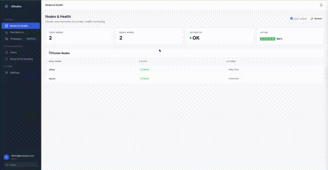

# Gthulhu: From Kubernetes Resource Allocation to Linux Task Scheduling

<a href="https://landscape.cncf.io/?item=provisioning--automation-configuration--gthulhu" target="_blank"></a>
<a href="https://ebpf.io/applications/" target="_blank"></a>

[](https://insights.linuxfoundation.org/project/gthulhu)
[](https://github.com/Gthulhu/Gthulhu/actions/workflows/go.yaml)
[](https://github.com/Gthulhu/Gthulhu/actions/workflows/portability.yaml)
[](https://goreportcard.com/report/github.com/Gthulhu/Gthulhu)


> **DRA chooses what and where; Gthulhu controls how it actually runs.**

Gthulhu is a cloud-native runtime scheduling platform built around Kubernetes, eBPF, and Linux `sched_ext`.

Kubernetes can decide **whether a workload may run**, **which node it runs on**, and increasingly **which GPU, NIC, CPU set, NUMA domain, or other device it receives**. But those allocation decisions do not by themselves guarantee that the workload's critical Linux threads receive the CPU service, locality, responsiveness, or isolation needed to meet an SLO.

Gthulhu focuses on that execution gap.

```text
Kueue / Workload API
  admission, quota, fair sharing
            │
            ▼
kube-scheduler / DRA
  Node + device + topology allocation
            │
            ▼
Gthulhu Runtime Plane
  workload / claim → Pod/cgroup → TGID/TID
            │
            ▼
sched_ext + eBPF
  runtime policy + verification
            │
            ▼
Delivered workload SLO
  latency / throughput / jitter / utilization
```

The long-term direction is **Claim2Core**: connect actual Kubernetes allocation to Linux task scheduling without reimplementing kube-scheduler, DRA, or Kueue. See the [2026 Claim2Core roadmap](https://github.com/Gthulhu/Gthulhu/issues/141).



> Demo video: https://youtu.be/Cyjrh9cW1a8

## What Gthulhu Does Today

### Scheduling observability

Gthulhu uses eBPF to collect scheduler behavior at process/task level and aggregate it into Kubernetes-aware metrics, including:

- CPU runtime and scheduler wait time;
- voluntary / involuntary context switches;
- run count and scheduling frequency;
- CPU migrations;
- workload-level scheduling pressure.

These metrics can be exported to Prometheus/Grafana and used by KEDA for autoscaling.

### Distributed scheduling intent

A central **Manager** resolves workload-level policy and distributes intent to a per-node **Decision Maker**. Each Decision Maker resolves local processes/tasks and exposes node-local strategies to the Gthulhu daemon.

### Custom CPU scheduling with `sched_ext`

On Linux 6.12+ with `sched_ext`, Gthulhu can apply workload-aware CPU scheduling policy without patching the kernel.

Current policy primitives include:

- priority treatment;
- custom time slices;
- CPU locality / affinity hints;
- preemption-oriented behavior where supported by the scheduler path.

### TID-aware node policies

Linux schedules tasks/threads, not only process leaders. Node policies therefore scan `/proc/<tgid>/task/<tid>` and can match non-leader worker threads by `comm`.

This matters for workloads where the critical work happens in named worker threads, such as:

- LLM engine/decode workers;
- NCCL/RDMA progress threads;
- DPDK or packet-processing workers;
- host-side helper threads.

A node policy resolved to a worker thread is keyed by **TID**, so the scheduler can target the entity Linux actually dispatches.

### Priority semantics across scheduler modes

A strategy with `Priority > 0` is a boost. `Priority == 0` is non-boosting.

- In **user-space mode**, a TID-specific strategy is preferred, with TGID fallback for group-wide Pod policy behavior. A slice-only rule can still carry a custom time slice without jumping the queue.
- In **kernel mode**, non-boosting strategies are not inserted into the priority BPF map. This avoids interpreting priority `0` as the highest preemptive level. Kernel mode does not yet provide full slice-only parity with user-space mode.

These semantics reflect the merged TID-aware scheduler work in the main repository and `Gthulhu/plugin`.

## Claim2Core Direction

The next architecture step is not "use ResourceSlice as another selector". The intended boundary is:

- `ResourceSlice` = device **inventory**;
- `ResourceClaim.status.allocation` = workload's **actual allocation**;
- Gthulhu = runtime execution plane after allocation.

The target lineage is:

```text
Workload / PodGroup UID
  → Pod UID
  → ResourceClaim UID + generation
  → allocated driver / pool / device
  → NUMA / PCIe / network topology
  → Pod cgroup
  → TGID / TID / starttime
  → sched_ext DSQ / BPF-map entry
  → observed runtime metrics
  → workload SLO
```

Near-term implementation order:

1. correct DRA / ResourceSlice semantics;
2. add a read-only ResourceClaim observer;
3. add Claim-to-Task preview / provenance;
4. introduce a bounded static `DRAExecutionPolicy`;
5. validate one workload adapter (free5GC/UPF or LLM serving);
6. add closed-loop runtime control only after static policy and provenance are trustworthy.

### Hard boundaries

Gthulhu is **not a GPU scheduler**. `sched_ext` schedules Linux CPU tasks; Gthulhu does not directly schedule CUDA kernels, GPU SMs, MIG, or NIC hardware queues.

Gthulhu can improve host-side execution for GPU feeder/launch threads, tokenizers, NCCL/RDMA progress threads, DPDK pollers, packet-processing workers, data loaders, checkpoint workers, and similar tasks.

CPU DRA, cgroups, kubelet, and other resource managers remain authoritative for the CPU/resource envelope. Gthulhu must optimize **inside** that envelope, never outside it.

## Architecture

```text
┌────────────────────────────────────────────────────────────────────┐
│                         Gthulhu Control Plane                       │
│                                                                    │
│  User / Web UI / CRD ──▶ Manager ──▶ MongoDB / Kubernetes API     │
└──────────────────────────────┬─────────────────────────────────────┘
                               │ scheduling intent / runtime config
                  ┌────────────┴────────────┐
                  ▼                         ▼
         Decision Maker              Decision Maker
            (Node 1)                    (Node N)
             │   │                        │   │
             │   ├── eBPF metrics        │   ├── eBPF metrics
             │   └── task resolution     │   └── task resolution
             ▼                            ▼
        Gthulhu daemon               Gthulhu daemon
             │                            │
             └──────▶ sched_ext / BPF ◀───┘
                         │
                         ▼
                   Linux scheduler
```

## Prerequisites

### Metrics / monitoring

- Go 1.22+
- LLVM/Clang 17+
- libbpf
- Linux kernel with eBPF/BTF support

### Custom CPU scheduling

- Linux 6.12+ with `sched_ext` / `CONFIG_SCHED_CLASS_EXT`

The eBPF monitor does not require `sched_ext`. Custom CPU scheduling does.

See the [installation guide](https://gthulhu.org/installation/) for deployment details.

## Build

```bash
make dep
git submodule init
git submodule sync
git submodule update
cd scx
cargo build --release -p scx_rustland
cd ..
make build
```

Cross-build for arm64:

```bash
make build ARCH=arm64
```

Lint:

```bash
make lint
```

## Test

```bash
make test
```

Or select a kernel version:

```bash
make test KERNEL_VERSION=6.12
```

Gthulhu runs daily portability tests across supported Linux 6.12+ kernels.

## Run with schedkit

Install `schedctl` from [schedkit](https://github.com/schedkit/schedctl), then run:

```bash
sudo schedctl run gthulhu
```

## Run with Docker

```bash
docker run --privileged=true --pid host --rm ghcr.io/gthulhu/gthulhu:latest /gthulhu/main
```

## Debugging

```bash
sudo bpftool prog list
sudo bpftool map list
sudo cat /sys/kernel/debug/tracing/trace_pipe
```

## Related repositories

- [qumun](https://github.com/Gthulhu/qumun) — Go framework for building custom Linux schedulers with eBPF / `sched_ext`.
- [plugin](https://github.com/Gthulhu/plugin) — user-space scheduling strategy implementation.
- [docs](https://github.com/Gthulhu/docs) — official documentation published at [gthulhu.org](https://gthulhu.org/).
- [gtp5g-operator](https://github.com/Gthulhu/gtp5g-operator) — telecom / GTP5G integration work.

## Research / workload directions

Two immediate validation paths are especially useful:

- **CPU DRA × Gthulhu × free5GC/UPF** — fastest path to a credible end-to-end runtime scheduling demo with p99/p99.9 latency and jitter.
- **GPU + RDMA + CPU DRA × phase-aware LLM scheduling** — higher research upside around TTFT, ITL, GPU idle gaps, and NCCL/RDMA progress.

Longer term, Gthulhu is also exploring device-local execution domains, scheduling provenance/replay, shared-device interference control, device-health-aware degradation, and cooperative resource reclamation.

## Meaning of the Name

The name Gthulhu is inspired by Cthulhu and Golang. The many tentacles represent coordinating complex distributed runtime behavior.

The underlying framework **qumun** is named after the Bunun word for "heart", reflecting the scheduler's role at the heart of the operating system.

## Contributing

See [CONTRIBUTING.md](CONTRIBUTING.md) and the [official contribution guide](https://gthulhu.org/contributing/).

Useful contributor areas include Kubernetes/DRA, eBPF, `sched_ext`, NUMA/topology, scheduling provenance, testing, free5GC/UPF, and accelerator workloads.

## Community

- [2026 Claim2Core roadmap](https://github.com/Gthulhu/Gthulhu/issues/141)
- [GitHub Discussions](https://github.com/Gthulhu/Gthulhu/discussions)
- [Official documentation](https://gthulhu.org/)
- [LFX project insights](https://insights.linuxfoundation.org/project/gthulhu)

## License

Apache License 2.0.

## Special Thanks

- [sched-ext/scx](https://github.com/sched-ext/scx)
- [libbpfgo](https://github.com/aquasecurity/libbpfgo)
