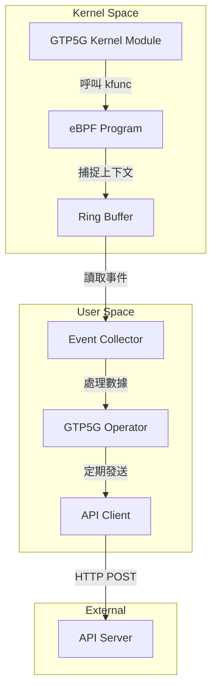

# GTP5G Operator

> 追蹤 GTP5G kernel module kfuncs 執行上下文，並定期發送資料到 API Server

## 專案簡介

- **開發者**: @c9274326
- **相關 Issue**: [#11](https://github.com/Gthulhu/Gthulhu/issues/11)
- **開始日期**: 2025-11-21
- **目標**: 使用 eBPF 技術追蹤 GTP5G kernel module 的關鍵函數 (kfuncs) 執行上下文，並將收集到的數據定期發送到 API Server 進行監控與分析。

## 技術架構



## 目錄結構

```text
gtp5g_operator/
├── bpf/            # eBPF C 程式碼 (Kernel Space)
├── pkg/
│   ├── operator/   # Operator 核心邏輯
│   ├── collector/  # 事件收集器
│   ├── api/        # API 客戶端
│   └── config/     # 設定管理
├── cmd/            # 主程式入口
├── config/         # 設定檔
├── docs/           # 文件
└── scripts/        # 腳本
```

## 開發進度

- [x] **Step 0**: 環境準備與專案初始化
- [ ] **Step 1**: 理解 GTP5G
- [ ] **Step 2**: 分析 GTP5G 原始碼
- [ ] **Step 3**: 學習 eBPF 基礎
- [ ] **Step 4**: 撰寫 eBPF 程式 (追蹤 kfuncs)
- [ ] **Step 5**: 使用 Go 載入 eBPF Object
- [ ] **Step 6**: 實作 User Space 事件收集
- [ ] **Step 7**: 定義 API 資料結構與 Client
- [ ] **Step 8**: 整合資料發送邏輯
- [ ] **Step 9**: 錯誤處理與重連機制
- [ ] **Step 10**: 設定檔管理
- [ ] **Step 11**: 測試與部署

## 參考資料

- [GTP5G Repository](https://github.com/free5gc/gtp5g)
- [eBPF Documentation](https://ebpf.io/)
- [Gthulhu Project](https://github.com/Gthulhu/Gthulhu)

## 開發日誌

詳細的開發過程與學習筆記請參考：[GTP5G Operator 開發日誌](docs/blog/gtp5g-operator-dev-log.md)
