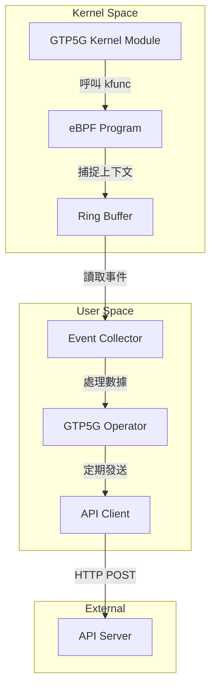

# GTP5G Operator

> 追蹤 GTP5G kernel module kfuncs 執行上下文，並定期發送資料到 API Server

## 專案簡介

- **開發者**: @c9274326
- **相關 Issue**: [#11](https://github.com/Gthulhu/Gthulhu/issues/11)
- **開始日期**: 2025-11-21
- **目標**: 使用 eBPF 技術追蹤 GTP5G kernel module 的關鍵函數 (kfuncs) 執行上下文，並將收集到的數據定期發送到 API Server 進行監控與分析。

## 技術架構



## 目錄結構

```text
gtp5g_operator/
├── bpf/            # eBPF C 程式碼 (Kernel Space)
├── pkg/
│   ├── operator/   # Operator 核心邏輯
│   ├── collector/  # 事件收集器
│   ├── api/        # API 客戶端
│   └── config/     # 設定管理
├── cmd/            # 主程式入口
├── config/         # 設定檔
├── docs/           # 文件
└── scripts/        # 腳本
```

## 開發進度

- [x] **Step 0**: 環境準備與專案初始化
- [x] **Step 1**: 理解 GTP5G
- [x] **Step 2**: 分析 GTP5G 原始碼
- [x] **Step 3**: 學習 eBPF 基礎
- [x] **Step 4**: 撰寫 eBPF 程式 (追蹤 kfuncs) - Toy 版本完成
- [x] **Step 5**: 使用 Go 載入 eBPF Object
- [x] **Step 6**: 實作 User Space 事件收集 - Toy Loader 完成
- [x] **Step 7**: 成功捕獲真實 GTP 事件 ✅ **重大里程碑！**
- [x] **Step 8-10**: 修復 GTP5G 模組以支援 fentry/fexit 追蹤 ✅ **技術突破！**
- [x] **Step 11**: 解析 trace_pipe 並發送 nr-gnb PID 到 Gthulhu API Server ✅ **實作完成！**
- [ ] **Step 12**: 實作 GTP 封包解析 (讀取 IP、TEID, Ports)
- [ ] **Step 13**: 使用 Ring Buffer 傳送結構化數據到用戶空間

## 部署架構

### 系統組件

```
┌─────────────────────────────────────────────────────────────┐
│                     Kubernetes Cluster                       │
├─────────────────────────────────────────────────────────────┤
│                                                               │
│  ┌───────────────┐         ┌──────────────────┐            │
│  │  gtp5g-tracer │────────▶│ GTP5G Operator   │            │
│  │   (eBPF)      │  pipe   │  (Go Service)    │            │
│  └───────────────┘         └──────────────────┘            │
│         │                           │                        │
│         │ fentry/fexit              │ HTTP POST             │
│         ▼                           ▼                        │
│  ┌───────────────┐         ┌──────────────────┐            │
│  │  GTP5G Module │         │ Gthulhu API      │            │
│  │  (Kernel)     │         │  Server          │            │
│  └───────────────┘         └──────────────────┘            │
│                                     │                        │
│                                     │ Update策略             │
│                                     ▼                        │
│                            ┌──────────────────┐            │
│                            │ Gthulhu Scheduler│            │
│                            │  (BPF Scheduler) │            │
│                            └──────────────────┘            │
└─────────────────────────────────────────────────────────────┘
```

### 數據流向

1. **GTP 流量捕獲**：UE 產生流量 → GTP5G 模組處理封包 → gtp5g-tracer (eBPF) 捕獲函數調用
2. **PID 提取**：trace_pipe 輸出事件 → GTP5G Operator 解析 → 提取 nr-gnb PID
3. **策略更新**：定期（每 10 秒）→ POST PID 列表到 Gthulhu API → 更新排程策略
4. **調度優化**：Gthulhu Scheduler 根據策略 → 提升 nr-gnb 進程優先級 → 優化 5G 網路性能

### 快速開始

#### 本地測試

```bash
# 1. 確保 gtp5g-tracer 正在運作
cd ../gtp5g-tracer
sudo ./main

# 2. 測試 operator（需要 root 權限）
cd ../gtp5g_operator
sudo ./test-local.sh
```

#### Kubernetes 部署

```bash
# 1. 建立 Docker image
./build.sh

# 2. 部署至 Kubernetes
kubectl apply -f deployment.yaml

# 3. 查看運作狀態
kubectl get pods -l app=gtp5g-operator
kubectl logs -f deployment/gtp5g-operator
```

詳細的開發流程與實作細節請參考：
- [開發日誌 Step 11](docs/blog/gtp5g-operator-dev-log.md#step-11-解析-trace_pipe-並發送-nr-gnb-pid-到-gthulhu-api-server)
- [實作總結文件](IMPLEMENTATION.md)

## 參考資料

- [GTP5G Repository](https://github.com/free5gc/gtp5g)
- [eBPF Documentation](https://ebpf.io/)
- [Gthulhu Project](https://github.com/Gthulhu/Gthulhu)

## 開發日誌

詳細的開發過程與學習筆記請參考：[GTP5G Operator 開發日誌](docs/blog/gtp5g-operator-dev-log.md)
