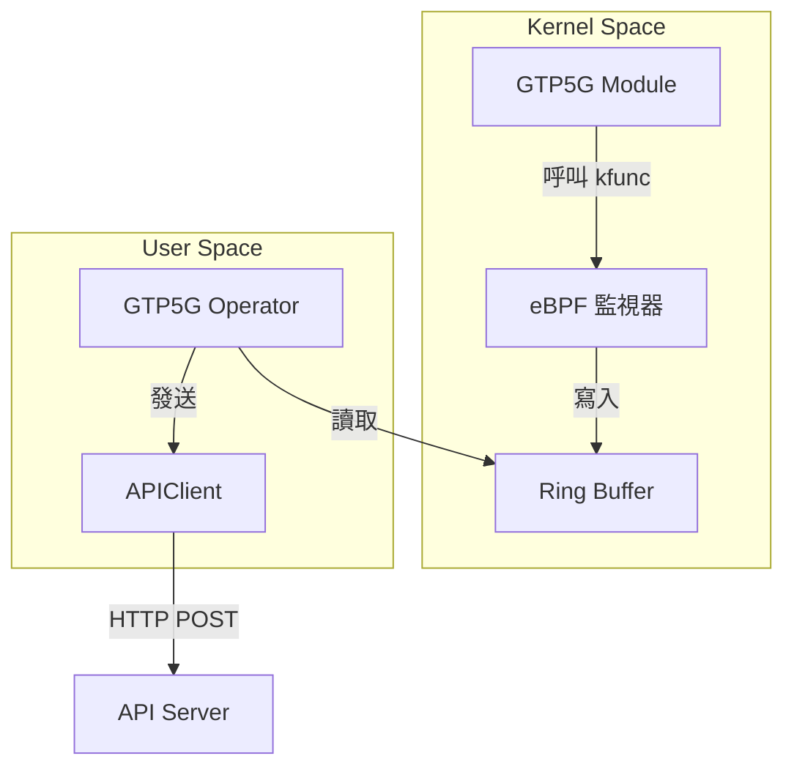

# GTP5G Operator 開發日誌

- **開發者**: c9274326
- **開始日期**: 2025-11-21
- **專案目標**: 開發 GTP5G Operator
- **相關 Issue**: [#11](https://github.com/Gthulhu/Gthulhu/issues/11)

---

## 目錄

- [專案簡介](#專案簡介)
- [開發環境](#開發環境)
- [Step 0: 環境準備與專案初始化](#step-0-環境準備與專案初始化)
- [Step 1: 理解 GTP5G 是什麼](#step-1-理解-gtp5g-是什麼)
- [附錄：每日工作記錄模板](#附錄每日工作記錄模板)

---

## 專案簡介

### 什麼是 GTP5G？

想像一下，GTP5G 就像是一個 **「包裹運送系統」** 📦。

在 5G 網路中，數據封包（包裹）需要從使用者的手機傳送到網際網路，中間會經過很多站點。GTP (GPRS Tunneling Protocol) 就是用來封裝這些包裹的「專用信封」。

GTP5G 是一個 Linux Kernel Module，它的工作就是在核心層級快速地處理這些信封：
1. **封裝 (Encap)**：把使用者的數據包裝進 GTP 信封。
2. **解封裝 (Decap)**：把收到的 GTP 信封拆開，取出裡面的數據。

### 我們要做什麼？

我們要開發一個 **「監視器」 (Operator)** 📹。

這個監視器會安裝在 Linux 核心旁邊，利用 **eBPF** 技術（一種安全且高效的內核監控魔法），偷偷觀察 GTP5G 模組的一舉一動。

當 GTP5G 處理封包時，我們的監視器會記錄：
- 它是什麼時候處理的？
- 處理了哪個封包？
- 花了多少時間？

然後，監視器會把這些情報整理好，定期回報給總部（API Server）。

### 技術架構



---

## 開發環境

- **OS**: Ubuntu 25.04
- **Kernel**: 6.12+ (支援最新的 eBPF 功能)
- **Go**: 1.24.2
- **LLVM/Clang**: 17+ (用於編譯 eBPF C 程式碼)

---

## Step 0: 環境準備與專案初始化

📅 **日期**: 2025-11-21
🎯 **目標**: 建立專案結構，確保一切就緒。

### ✅ 工作清單

- [x] 建立 Git 分支 `feature/gtp5g-operator`
- [x] 建立專案目錄結構
- [x] 初始化 Go Module
- [x] 建立 README.md
- [x] 建立 Makefile
- [x] 建立開發日誌

### 📝 詳細步驟

1. **建立分支**：
   為了不影響主程式，我開了一個新分支：
   ```bash
   git checkout -b feature/gtp5g-operator
   ```

2. **建立目錄**：
   參考了標準的 Go 專案結構，建立了 `bpf/`, `cmd/`, `pkg/`, `config/` 等目錄。

3. **初始化 Go Module**：
   ```bash
   go mod init github.com/Gthulhu/Gthulhu/gtp5g_operator
   ```

4. **撰寫文件**：
   好的文件是成功的一半！我先寫好了 `README.md` 和這份開發日誌，明確定義了目標和架構。

### 💡 學到了什麼

- **專案架構的重要性**：一開始把目錄規劃好，後面開發才不會亂。
- **文件先行**：先寫 README 幫助我釐清了整個系統的資料流向。

### 🚀 下一步

接下來要進入正題了！我要去研究 GTP5G 到底是怎麼運作的。

---

## Step 1: 理解 GTP5G 是什麼

🎯 **目標**: 學習 GTP5G 的基礎知識，理解它在 5G 核心網中的角色。

### 📋 待辦清單

- [ ] (待填寫)

---

## 附錄：每日工作記錄模板

### 📅 [日期] Step X: [標題]

**今日目標**: [簡短描述]

**進度**:
- [ ] 任務 1
- [ ] 任務 2

**筆記**:
- 遇到的問題...
- 解決方法...
- 新學到的知識...
