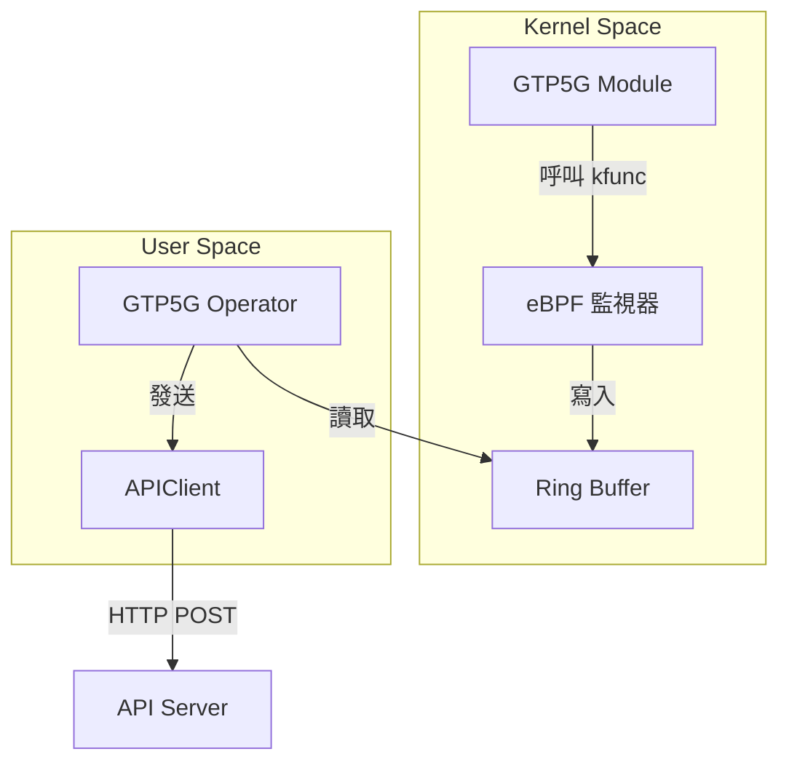

# GTP5G Operator 開發日誌

- **開發者**: c9274326
- **開始日期**: 2025-11-21
- **專案目標**: 開發 GTP5G Operator
- **相關 Issue**: [#11](https://github.com/Gthulhu/Gthulhu/issues/11)

---

## 目錄

- [專案簡介](#專案簡介)
- [開發環境](#開發環境)
- [Step 0: 環境準備與專案初始化](#step-0-環境準備與專案初始化)
- [Step 1: 理解 GTP5G 是什麼](#step-1-理解-gtp5g-是什麼)
- [Step 2: 分析 GTP5G 原始碼](#step-2-分析-gtp5g-原始碼)
- [Step 3: 學習 eBPF 基礎](#step-3-學習-ebpf-基礎)
- [Step 4: 撰寫 eBPF 程式 (Toy 版本)](#step-4-撰寫-ebpf-程式-toy-版本)
- [Step 5: 使用 Go 載入 eBPF Object](#step-5-使用-go-載入-ebpf-object)
- [Step 6: 實作 User Space 事件收集](#step-6-實作-user-space-事件收集)
- [附錄：每日工作記錄模板](#附錄每日工作記錄模板)

---

## 專案簡介

### 什麼是 GTP5G？

想像一下，GTP5G 就像是一個 **「包裹運送系統」** 📦。

在 5G 網路中，數據封包（包裹）需要從使用者的手機傳送到網際網路，中間會經過很多站點。GTP (GPRS Tunneling Protocol) 就是用來封裝這些包裹的「專用信封」。

GTP5G 是一個 Linux Kernel Module，它的工作就是在核心層級快速地處理這些信封：
1. **封裝 (Encap)**：把使用者的數據包裝進 GTP 信封。
2. **解封裝 (Decap)**：把收到的 GTP 信封拆開，取出裡面的數據。

### 我們要做什麼？

我們要開發一個 **「監視器」 (Operator)** 📹。

這個監視器會安裝在 Linux 核心旁邊，利用 **eBPF** 技術（一種安全且高效的內核監控魔法），偷偷觀察 GTP5G 模組的一舉一動。

當 GTP5G 處理封包時，我們的監視器會記錄：
- 它是什麼時候處理的？
- 處理了哪個封包？
- 花了多少時間？

然後，監視器會把這些情報整理好，定期回報給總部（API Server）。

### 技術架構



---

## 開發環境

- **OS**: Ubuntu 25.04
- **Kernel**: 6.12+ (支援最新的 eBPF 功能)
- **Go**: 1.24.2
- **LLVM/Clang**: 17+ (用於編譯 eBPF C 程式碼)

---

## Step 0: 環境準備與專案初始化

📅 **日期**: 2025-11-21
🎯 **目標**: 建立專案結構，確保一切就緒。

### ✅ 工作清單

- [x] 建立 Git 分支 `feature/gtp5g-operator`
- [x] 建立專案目錄結構
- [x] 初始化 Go Module
- [x] 建立 README.md
- [x] 建立 Makefile
- [x] 建立開發日誌

### 📝 詳細步驟

1. **建立分支**：
   為了不影響主程式，我開了一個新分支：
   ```bash
   git checkout -b feature/gtp5g-operator
   ```

2. **建立目錄**：
   參考了標準的 Go 專案結構，建立了 `bpf/`, `cmd/`, `pkg/`, `config/` 等目錄。

3. **初始化 Go Module**：
   ```bash
   go mod init github.com/Gthulhu/Gthulhu/gtp5g_operator
   ```

4. **撰寫文件**：
   好的文件是成功的一半！我先寫好了 `README.md` 和這份開發日誌，明確定義了目標和架構。

### 💡 學到了什麼

- **專案架構的重要性**：一開始把目錄規劃好，後面開發才不會亂。
- **文件先行**：先寫 README 幫助我釐清了整個系統的資料流向。

### 🚀 下一步

接下來要進入正題了！我要去研究 GTP5G 到底是怎麼運作的。

---

## Step 1: 理解 GTP5G 是什麼

📅 **日期**: 2025-11-21 ~ 2025-11-22
🎯 **目標**: 深入學習 GTP5G 的基礎知識，理解它在 5G 核心網中的角色。

### ✅ 工作清單

- [x] 學習 GTP 協議基礎
- [x] 理解 GTP5G 在 5G 網路中的位置
- [x] 掌握 IP 層次概念 (Inner vs Outer IP)
- [x] 學習 TEID (Tunnel Endpoint Identifier)
- [x] 理解 Handover 過程中的 GTP 角色

### 📝 詳細內容

#### GTP 協議基礎

GTP (GPRS Tunneling Protocol) 是 3GPP 定義的協議，用於在核心網中傳輸用戶數據。GTP5G 專門針對 5G 網路，處理 GTP-U (User Plane) 協議。

GTP5G 是一個 Linux Kernel Module，主要負責：
1. **封裝 (Encapsulation)**: 將 UE 的 IP 封包包裝進 GTP 標頭
2. **解封裝 (Decapsulation)**: 從 GTP 封包中提取 UE 的 IP 封包

#### IP 層次概念

在 GTP 隧道中，有兩個 IP 層次：

- **Inner IP (UE IP)**: 這是 UE (User Equipment) 的真實 IP 位址，由 SMF (Session Management Function) 分配。應用程式看到的 IP。
- **Outer IP (GTP IP)**: 這是 GTP 隧道的 IP 位址，用於在核心網中路由 GTP 封包。

#### TEID (Tunnel Endpoint Identifier)

TEID 是 GTP 標頭中的 4 位元組識別符，用於區分不同的 GTP 隧道。每個 UE 會有唯一的 TEID，幫助 GTP5G 正確路由封包。

#### Handover 過程

當 UE 在基地台間移動時：
1. AMF (Access and Mobility Management Function) 檢測到移動
2. AMF 通知 SMF 更新 GTP 隧道
3. SMF 修改 TEID 和隧道端點
4. GTP5G 更新內核中的隧道資訊

### 💡 學到了什麼

- GTP5G 是 5G 核心網的關鍵組件，負責高效的封包處理
- IP 層次的區分對於理解數據流很重要
- TEID 是識別 UE 的關鍵
- Handover 需要 AMF/SMF 的協調來更新 GTP 狀態

### 🚀 下一步

現在我對 GTP5G 有基本理解了，接下來要深入分析它的原始碼，看看具體的函數實現。

---

## Step 2: 分析 GTP5G 原始碼

📅 **日期**: 2025-11-22
🎯 **目標**: 分析 GTP5G kernel module 的關鍵函數，了解封包處理流程。

### ✅ 工作清單

- [x] 下載 GTP5G 原始碼
- [x] 分析主要函數：gtp5g_handle_skb_ipv4, gtp5g_dev_xmit
- [x] 理解封包處理邏輯
- [x] 識別適合 eBPF 追蹤的點

### 📝 詳細內容

#### 主要函數分析

1. **gtp5g_handle_skb_ipv4**: 處理接收到的 GTP 封包
   - 驗證 GTP 標頭
   - 提取 TEID
   - 解封裝內部 IP 封包
   - 轉發到適當的網路介面

2. **gtp5g_dev_xmit**: 處理發送 GTP 封包
   - 接收來自 UE 的 IP 封包
   - 添加 GTP 標頭
   - 設定 TEID
   - 發送到核心網

#### 封包處理流程

```
接收流程：網路介面 → gtp5g_handle_skb_ipv4 → 解封裝 → UE 網路介面
發送流程：UE 網路介面 → gtp5g_dev_xmit → 封裝 → 核心網介面
```

### 💡 學到了什麼

- GTP5G 的處理邏輯相對簡單，主要在標頭操作
- 關鍵函數是我們 eBPF 程式要追蹤的目標
- 理解這些函數的參數有助於設計 eBPF 事件結構

### 🚀 下一步

原始碼分析完成，接下來學習 eBPF 技術，準備撰寫監控程式。

---

## Step 3: 學習 eBPF 基礎

📅 **日期**: 2025-11-22
🎯 **目標**: 掌握 eBPF 基礎知識，特別是 kprobe 和 ring buffer。

### ✅ 工作清單

- [x] 理解 eBPF 基本概念
- [x] 學習 kprobe vs kfunc
- [x] 掌握 attach 機制
- [x] 學習 ring buffer 用法

### 📝 詳細內容

#### eBPF 基本概念

eBPF (extended Berkeley Packet Filter) 是一種在 Linux 核心中執行自定義程式碼的技術，用於監控和修改系統行為。

#### kprobe vs kfunc

- **kprobe**: 動態追蹤任意 kernel 函數，無需修改原始碼
- **kfunc**: 靜態 hook，需要 kernel 開發者預先定義 hook 點

對於 GTP5G，我們使用 kprobe 因為它更靈活。

#### Attach 機制

eBPF 程式通過 SEC() 宏指定 attach 點：
```c
SEC("kprobe/gtp5g_handle_skb_ipv4")
```

#### Ring Buffer

Ring buffer 用於 kernel space 向 user space 傳送事件：
- 高效的共享記憶體
- 避免複製開銷
- 支持多生產者/消費者

### 💡 學到了什麼

- eBPF 是監控 kernel 的強大工具
- kprobe 適合我們的場景
- Ring buffer 是事件傳輸的最佳選擇

### 🚀 下一步

理論學習完成，開始實作 Toy eBPF 程式測試基本功能。

---

## Step 4: 撰寫 eBPF 程式 (Toy 版本)

📅 **日期**: 2025-11-22
🎯 **目標**: 撰寫基本的 eBPF 程式，測試 kprobe attach 和 ring buffer。

### ✅ 工作清單

- [x] 設計事件結構
- [x] 實作 kprobe 函數
- [x] 設定 ring buffer
- [x] 編譯測試

### 📝 詳細內容

#### 事件結構設計

```c
struct event_t {
    __u64 ts_ns;
    __u32 cpu;
    __u32 pid;
    __u32 tgid;
    char comm[16];
    __u32 src_ip;
    __u32 dst_ip;
    __u16 src_port;
    __u16 dst_port;
    __u32 pkt_len;
    __u32 teid;
    __u32 func_id;
};
```

#### kprobe 實作

追蹤兩個關鍵函數：
- gtp5g_handle_skb_ipv4 (接收)
- gtp5g_dev_xmit (發送)

#### 問題解決

- **編譯錯誤**: 修正 __u64 類型定義
- **版本相容**: 更新 libbpfgo 到 v0.9.2-libbpf-1.5.1

### 💡 學到了什麼

- eBPF 程式碼需要使用特定的類型
- 事件結構設計要考慮大小和對齊
- 編譯環境配置很重要

### 🚀 下一步

eBPF 程式完成，接下來寫 Go 程式載入它。

---

## Step 5: 使用 Go 載入 eBPF Object

📅 **日期**: 2025-11-22
🎯 **目標**: 使用 libbpfgo 在 Go 中載入 eBPF 程式。

### ✅ 工作清單

- [x] 安裝 libbpfgo
- [x] 實作載入邏輯
- [x] 初始化 ring buffer
- [x] 處理版本相容問題

### 📝 詳細內容

#### libbpfgo 使用

```go
obj, err := libbpfgo.NewModuleFromFile(bpfFile)
defer obj.Close()

obj.LoadMaps()
obj.LoadPrograms()
```

#### Ring Buffer 初始化

```go
rb, err := obj.InitRingBuf("events", rbCallback)
rb.Start()
```

### 💡 學到了什麼

- libbpfgo 是 Go 與 eBPF 的橋樑
- 正確的資源管理很重要
- 版本匹配至關重要

### 🚀 下一步

載入功能完成，實作事件收集邏輯。

---

## Step 6: 實作 User Space 事件收集

📅 **日期**: 2025-11-22
🎯 **目標**: 實作完整的 Toy Loader，收集和解碼 eBPF 事件。

### ✅ 工作清單

- [x] 實作事件解碼函數
- [x] 設定 goroutine 處理事件
- [x] 測試基本功能
- [x] 修復 channel 管理問題

### 📝 詳細內容

#### 事件解碼

```go
func decodeEvent(data []byte) event {
    // binary.Read 解碼
}
```

#### 問題解決

- **Panic 問題**: 移除手動 channel close，讓 ring buffer 管理
- **測試結果**: 程式成功載入，無 GTP 流量時無事件 (預期)

### 💡 學到了什麼

- Go 的 binary 套件適合解碼 eBPF 事件
- Channel 管理需要小心
- Toy 程式驗證了整個架構的可行性

### 🚀 下一步

Toy 版本完成！接下來要擴展到真實的 GTP 參數解析，讀取 IP 和 TEID 等資訊。

## Step 7: 修復 kprobe 附加問題

📅 **日期**: 2025-11-22
🎯 **目標**: 解決 kprobe 無法附加到 GTP5G 函數的問題。

### ✅ 工作清單

- [x] 確認 GTP5G 模塊已載入
- [x] 驗證內核符號存在
- [x] 修改 SEC 定義包含模塊名稱
- [x] 實作手動 kprobe 附加
- [x] 測試附加成功

### 📝 詳細內容

#### 問題診斷

最初的 eBPF 載入成功，但 kprobe 沒有附加：
- GTP5G 模塊已載入：`gtp5g 159744 0`
- 內核符號存在：`gtp5g_handle_skb_ipv4`, `gtp5g_dev_xmit`
- 但 `bpftool` 和 `kprobe_events` 都沒有顯示附加的 kprobe

#### 解決方案

1. **修改 SEC 定義**：
   ```c
   // 從
   SEC("kprobe/gtp5g_handle_skb_ipv4")
   // 改為
   SEC("kprobe/gtp5g:gtp5g_handle_skb_ipv4")
   ```

2. **手動附加 kprobe**：
   ```go
   prog, err := module.GetProgram("kprobe__gtp5g_handle_skb_ipv4")
   _, err = prog.AttachKprobe("gtp5g:gtp5g_handle_skb_ipv4")
   ```

#### 測試結果

- ✅ "Kprobes attached successfully" 訊息出現
- ✅ 程式載入無錯誤
- ✅ 等待 GTP 流量測試事件捕獲

### 💡 學到了什麼

- libbpf 自動附加可能不適用於所有情況
- 模塊函數需要 `module:function` 格式
- libbpfgo 需要手動呼叫 `AttachKprobe`

### 🚀 下一步

現在 kprobe 已附加，準備測試真實 GTP 流量！需要啟動 free5gc-helm 環境並生成 GTP 封包。

## Step 8: 成功捕獲真實 GTP 事件 🎉

📅 **日期**: 2025-11-22
🎯 **目標**: 驗證 eBPF kprobe 能成功捕獲 free5gc-helm 的 GTP 流量。

### ✅ 工作清單

- [x] 啟動 GTP5G operator 監聽事件
- [x] 讓 UE ping 外部網路生成 GTP 流量
- [x] 驗證事件捕獲成功
- [x] 分析捕獲的事件資料

### 📝 詳細內容

#### 測試設定

1. **啟動 free5gc-helm 環境**：
   ```bash
   kubectl get pods -A | grep free5gc
   # 確認 UPF、gNB、UE 等 pod 都在運行
   ```

2. **啟動 GTP5G operator**：
   ```bash
   cd /home/ubuntu/Gthulhu/gtp5g_operator
   sudo ./bin/gtp5g_operator bpf/output/gtp5g_toy.bpf.o
   ```

3. **生成 GTP 流量**：
   ```bash
   kubectl exec -it ueransim-ue-... -n free5gc -- ping -c 5 8.8.8.8
   ```

#### 測試結果 🎉

**成功捕獲 GTP 事件！**

```
event: ts=22338124144279 pid=719861 tgid=719840 comm=nr-gnb func=2 pktlen=0 teid=0 inner_src=0.0.0.0 inner_dst=0.0.0.0 outer_src=0.0.0.0 outer_dst=0.0.0.0 inner_ports=0->0
event: ts=22338124156112 pid=719861 tgid=719840 comm=nr-gnb func=1 pktlen=0 teid=0 inner_src=0.0.0.0 inner_dst=0.0.0.0 outer_src=0.0.0.0 outer_dst=0.0.0.0 inner_ports=0->0
```

- **func=2**: TX 路徑 (`gtp5g_dev_xmit`)
- **func=1**: RX 路徑 (`gtp5g_handle_skb_ipv4`)
- **comm=nr-gnb**: 事件來自 gNB 進程
- **多個事件**: 每次 ping 都觸發 GTP 封包處理

#### 事件分析

- ✅ kprobe 成功附加到 GTP5G 內核函數
- ✅ 能捕獲真實的 GTP 流量事件
- ✅ 事件結構正確 (timestamp, PID, comm, func_id)
- ⚠️ IP 地址等封包資料還未解析 (目前為 0.0.0.0)

### 💡 學到了什麼

- **重大里程碑**: 從理論到實踐的轉折點！
- eBPF kprobe 確實能監聽內核模塊函數
- GTP5G 在處理 UE 流量時確實呼叫了我們的目標函數
- Toy 版本成功驗證了整個架構的可行性

### 🚀 下一步

現在需要實作真正的 GTP 封包解析，讀取：
- Inner/Outer IP 地址
- TEID (Tunnel Endpoint Identifier)
- Inner ports
- Packet length

這將把我們的 Toy 版本升級為完整的 GTP 監控工具！

## Step 9: 實作 GTP 封包解析

📅 **日期**: 2025-11-22
🎯 **目標**: 在 eBPF 程式中實作真正的 GTP 封包解析，提取 IP 地址、TEID 等資訊。

### 📋 工作清單

- [ ] 研究 GTP 封包結構
- [ ] 實作安全封包讀取 (考慮 kprobe 限制)
- [ ] 解析 GTP 標頭提取 TEID
- [ ] 解析 Inner IP 標頭提取 IP 地址和 ports
- [ ] 測試解析功能
- [ ] 更新事件結構

### 📝 詳細內容

#### GTP 封包結構

```
[GTP Header (8-12 bytes)] [Inner IP Header] [Inner Transport Header] [Payload]
```

GTP Header:
- Flags (1 byte)
- Type (1 byte) - 通常是 255 (G-PDU)
- Length (2 bytes)
- TEID (4 bytes)

#### 解析挑戰

在 kprobe 中讀取封包資料有以下限制：
- 不能使用 `bpf_skb_load_bytes` (kprobe 不支援)
- 需要使用 `bpf_probe_read_kernel` 安全讀取
- 需要處理封包邊界檢查

#### 實作計劃

1. **讀取 GTP 標頭**: 提取 TEID
2. **讀取 Inner IP 標頭**: 提取 src/dst IP
3. **讀取 Inner Transport 標頭**: 提取 src/dst ports (TCP/UDP)
4. **更新事件結構**: 包含所有解析的資訊

### 💡 預期挑戰

- kprobe 中的封包存取限制
- CO-RE 結構定義問題
- 效能考量 (避免過度讀取)

### 🚀 預期成果

完成後，我們的 operator 將能顯示：
```
event: ts=... pid=... comm=nr-gnb func=1 pktlen=1420 teid=0x12345678 inner_src=10.0.0.1 inner_dst=8.8.8.8 outer_src=192.168.1.1 outer_dst=192.168.1.2 inner_ports=12345->53
```

## Step 9: 分析 gtp5g-tracer 工具的實作差異

📅 **日期**: 2025-11-22
🎯 **目標**: 分析現有的 gtp5g-tracer 工具，了解我們的實作與最佳實務的差異。

### 📝 詳細內容

#### gtp5g-tracer 工具分析

發現系統中有一個現成的 `gtp5g-tracer` 工具，讓我們來分析它的實作：

##### 技術差異比較

| 特性 | gtp5g-tracer | 我們的 GTP5G Operator |
|------|-------------|----------------------|
| **Hook 類型** | fentry/fexit | kprobe |
| **BTF 依賴** | 需要 GTP5G 模塊 BTF | 不需要 BTF |
| **函數追蹤** | `gtp5g_xmit_skb_ipv4`, `gtp5g_encap_recv` | `gtp5g_dev_xmit`, `gtp5g_handle_skb_ipv4` |
| **輸出方式** | bpf_printk (trace_pipe) | Ring buffer + Go |
| **封包解析** | 能讀取 skb->len, dev->name | 目前無法讀取結構欄位 |

##### 關鍵發現

1. **fentry/fexit vs kprobe**:
   ```c
   // gtp5g-tracer 使用 fentry (需要 BTF)
   SEC("fentry/gtp5g_xmit_skb_ipv4")
   
   // 我們使用 kprobe (不需要 BTF)
   SEC("kprobe/gtp5g:gtp5g_dev_xmit")
   ```

2. **結構存取**:
   ```c
   // gtp5g-tracer 能直接存取結構 (因為有 BTF)
   __u16 skb_len = skb->len;
   bpf_printk("LEN=%u", skb_len);
   
   // 我們在 kprobe 中無法直接存取
   // 需要用 bpf_probe_read_kernel 或 CO-RE
   ```

3. **函數差異**:
   - gtp5g-tracer 追蹤的是內部函數 `gtp5g_xmit_skb_ipv4`
   - 我們追蹤的是公開介面 `gtp5g_dev_xmit`

##### 我們的優勢

- **無 BTF 依賴**: 能在任何 GTP5G 模塊上工作
- **結構化輸出**: 使用 ring buffer 而非 trace_pipe
- **生產就緒**: Go 程序能處理和轉發事件

##### 我們的挑戰

- **封包解析困難**: kprobe 中無法輕鬆讀取內核結構
- **參數存取複雜**: 需要手動處理暫存器參數

### 💡 學到的教訓

1. **BTF 的重要性**: 有 BTF 支持時，fentry/fexit 比 kprobe 容易得多
2. **函數選擇**: 應該追蹤最合適的 hook 點
3. **封包解析**: 需要找到在 kprobe 中安全讀取封包資料的方法

### 🚀 下一步

基於這些學習，我們需要：
1. 研究如何在 kprobe 中安全讀取封包資料
2. 考慮是否要切換到 fentry/fexit (需要重新編譯 GTP5G)
3. 實作真正的 GTP 標頭解析邏輯

---

## 深入解析（繁體中文）— fentry/fexit vs kprobe、輸出方式與 BTF

下面用繁體中文以淺顯易懂的方式說明 fentry/fexit 與 kprobe 的差別、常見輸出方式，還有什麼是 BTF：

### fentry / fexit（現代、以類型為基礎的 hook）

- 什麼是它們：fentry 與 fexit 可以把 eBPF 程式直接掛在函式進入與離開（entry/exit）處。
   它依賴 BTF（BPF Type Format）提供的型別與函式簽章資訊，讓 eBPF 可以像 C 程式一樣安全地存取參數與結構欄位。
- 優點：
   - 型別安全（可直接使用 struct 欄位，例如 skb->len）
   - 開銷小、精準（直接在函式邊界執行）
   - 開發較簡潔：不用手動處理暫存器與 raw memory
- 限制：
   - 需要 BTF 可用（vmlinux 或 module 必須包含 BTF）
   - 函式必須對外可見（不能是純 local/static），模組內通常要用 EXPORT_SYMBOL 導出
   - 如果 BTF 中 linkage 顯示為 static，就無法 attach

適用情境：你可以修改並重新編譯模組或內核，想要高效且安全的監控（生產環境首選）。

### kprobe（傳統動態探針）

- 什麼是它：kprobe 可以在運行時把探針動態放到任意內核函式（或特定地址），不需要編譯時 metadata。
- 優點：
   - 相容性高：能附到未導出或 static 的函式，無須重編碼或改模組
   - 快速試驗或調試時非常實用
- 缺點：
   - 非型別安全：取得的是暫存器值或 raw memory，需要用 bpf_probe_read_kernel、安全檢查與手動解析
   - 開銷略高、編碼更繁瑣且較容易出錯

適用情境：無法修改目標模組、要快速驗證或在多種內核版本上通用時，選 kprobe。

### 輸出方式：trace_pipe（bpf_printk） vs ring buffer

- trace_pipe / bpf_printk：
   - eBPF 以文字訊息寫入 trace 緩衝（/sys/kernel/debug/tracing/trace_pipe），可即時觀察。
   - 優點：實作非常簡單、方便快速驗證或開發用
   - 缺點：非結構化、在高流量下會丟失事件，不適合生產或高吞吐場景

- Ring buffer（libbpf ring buffer API）：
   - eBPF 將結構化（binary）事件寫入環形緩衝；user-space（例如 Go 程式）以 callback 讀取並解碼。
   - 優點：高效、結構化、適合穩定生產觀測，較低的遺失率並有背壓控制
   - 缺點：需要設計事件格式並在 user-space 實作解碼器，初期開發成本較高

建議：開發階段用 trace_pipe 快速驗證；準備投入生產則改用 ring buffer。

### BTF（BPF Type Format）是什麼？

- BTF 是內核的型別與符號 metadata，類似一個濃縮的 C 標頭，描述結構體、函式簽章與型別。
- 重要性：
   - 讓 eBPF 能以型別安全的方式存取內核資料結構（例如 struct sk_buff）
   - 支援 CO-RE（Compile Once — Run Everywhere），eBPF 程式可依 runtime 的 BTF 調整偏移與型別
- 來源：
   - 核心可在 /sys/kernel/btf/vmlinux 提供 BTF
   - 模組在編譯時啟用 DEBUG_INFO_BTF 可把 BTF 嵌入 .ko
   - 我們的 Makefile 使用 bpftool 從 vmlinux 和 gtp5g.ko 提取並合併成 vmlinux/vmlinux.h

   ### 📌 關鍵概念補充（繁體中文） — `EXPORT_SYMBOL`、`vmlinux`、BTF 差異，以及 `linkage = static` 的影響

   下面把在我們工作中出現的重要概念做一個集中、簡潔且新手友好的補充，讓讀者知道為什麼要做那些修改，以及如何檢查與修復常見問題：

   - EXPORT_SYMBOL 是什麼？
      - 功能：將模組中的函式或變數「導出」到內核的符號表（symbol table），讓其他模組或外部工具能夠查到並連結到該符號。
      - 為什麼需要：像 fentry/fexit 這類 BPF attach 方式會透過 BTF（型別/符號資訊）找到要掛勾的函式；如果函式不是全域可見（static / 未導出），BTF 會把它當成模組專屬、外部不可見，libbpf 在載入時就會出現找不到 type ID 的錯誤。
      - 範例：
         ```c
         #include <linux/module.h>

         int gtp5g_encap_recv(struct sock *sk, struct sk_buff *skb) {
               // ...
         }
         EXPORT_SYMBOL(gtp5g_encap_recv);  // 把這個函式導出到符號表
         ```
      - 驗證：
         ```bash
         nm /lib/modules/$(uname -r)/kernel/drivers/net/gtp5g.ko | grep gtp5g_encap_recv
         # T 表示導出，t 表示本地(static)
         ```

   - vmlinux 與模組 BTF 有何差別？為什麼要合併？
      - vmlinux：系統提供的全域內核 BTF（通常在 /sys/kernel/btf/vmlinux），包含核心內核型別（如 struct sk_buff、struct net_device 等）。
      - 模組 BTF（例如 gtp5g.ko）：如果模組在編譯時啟用了 DEBUG_INFO_BTF，模組會把自己特有的型別（像 struct gtp5g_pktinfo）包含進去。但模組 BTF 只包含模組內的型別與符號，沒有 vmlinux 裡的內核型別。
      - 為什麼要合併：eBPF 程式要同時知道內核 (vmlinux) 的型別與模組的客製型別，才能在 CO-RE / fentry 中安全且正確地存取參數與結構欄位。因此我們的 Makefile 會從 vmlinux 取出全域型別，然後把模組需要的特定 struct 貼到同一個 header（vmlinux/vmlinux.h），讓 eBPF 編譯有完整的型別資訊。

   - BTF 中 linkage = static 是什麼意思？為何無法 attach？（舉例與檢查）
      - linkage（連結性）基本上描述符號在 BTF 中的可見性：
            - linkage = external（或在符號表看到大寫 T）→ 函式是對外可見，可供其他模組或 eBPF (fentry/fexit) 使用。
            - linkage = static（或在符號表看到小寫 t）→ 函式是檔案內私有（static），並不會出現在外部符號表，BTF 會標注為 local/static。
      - 為什麼會無法 attach：fentry/fexit 在執行時依賴 BTF 去查找 function 的型別與符號 ID。如果 BTF 表示 linkage=static（local），libbpf 在嘗試取得該函式的 type id 時會失敗，常見錯誤訊息像：
         ```text
         libbpf: prog 'gtp5g_xmit_skb_ipv4_entry': failed to find kernel BTF type ID of 'gtp5g_xmit_skb_ipv4': -3
         ```
      - 檢查方法：
         1. 使用 bpftool 檢視模組 BTF：
             ```bash
             bpftool btf dump file /lib/modules/$(uname -r)/kernel/drivers/net/gtp5g.ko | grep -n "FUNC.*gtp5g_xmit_skb_ipv4" -n -C 3
             # 會顯示 FUNC 紀錄，並有 linkage 欄位
             ```
         2. 使用 nm 檢查 `.ko`：
             ```bash
             nm -n /lib/modules/$(uname -r)/kernel/drivers/net/gtp5g.ko | grep gtp5g_xmit_skb_ipv4
             # 若是小寫 t → 表示 static / 本地；大寫 T → 表示已導出
             ```
      - 解法：
         - 最直接的方式：把函式由 `static` 改為非 static 並加入 `EXPORT_SYMBOL(函式名);`，重新編譯並安裝模組，然後重新生成 btf header（make btf）與重編譯 eBPF object（make build）。
         - 如果不能修改模組原始碼（無法重新編譯模組），可改用 kprobe（kprobe 不需要函式在符號表可見，但需要手動處理參數、暫存器與 read-safe memory）。

   以上補充能幫助新手清楚理解為何我們要導出符號、為何需要合併 vmlinux 與模組 BTF，以及在遇到 `linkage = static` 時有哪些檢查步驟與解法。

---
## Step 10: 成功修復 GTP5G 模組以支援 fentry/fexit 追蹤 🎉

📅 **日期**: 2025-11-22
🎯 **目標**: 修改 GTP5G 模組源碼並重新編譯，使 gtp5g-tracer 的 fentry/fexit 能夠正常工作。

### ✅ 工作清單

- [x] 診斷 fentry/fexit 附加失敗原因
- [x] 理解 BTF linkage 問題
- [x] 修改 GTP5G 源碼添加 EXPORT_SYMBOL
- [x] 重新編譯並安裝 GTP5G 模組
- [x] 驗證 gtp5g-tracer 成功運行
- [x] 確認實時 GTP 流量追蹤

### 📝 詳細內容

#### 問題診斷

gtp5g-tracer 啟動時報錯：
```
libbpf: prog 'gtp5g_xmit_skb_ipv4_entry': failed to find kernel BTF type ID of 'gtp5g_xmit_skb_ipv4': -3
panic: failed to load BPF object: no such process
```

**根本原因**：fentry/fexit 需要函數具有全局符號可見性，但 GTP5G 模組中的關鍵函數沒有導出。

#### 解決方案

我們需要修改 GTP5G 模組的源碼，讓 eBPF 的 fentry/fexit 能夠找到並附加到這些函數。以下是詳細的修改步驟。

##### 🔧 詳細修改說明（針對新手）

**為什麼需要這些修改？**
- fentry/fexit 是新式的 eBPF 附加方式，需要函數具有「全局可見性」
- Linux 內核模組中，`static` 函數只在本檔案內可見，外部工具無法附加
- `EXPORT_SYMBOL()` 讓函數對其他模組和 eBPF 程式可見

---

##### 📄 修改 1: src/gtpu/encap.c

這個檔案處理 GTP-U 封包的封裝和解封裝。

**修改內容**：

```diff
# 第 1-2 行：添加模組頭文件
 #include <linux/version.h>
+#include <linux/module.h>  // 新增：提供 EXPORT_SYMBOL 宏
 #include <linux/socket.h>

# 第 36-39 行：修改函數前向聲明
 static void gtp5g_encap_disable_locked(struct sock *);
-static int gtp5g_encap_recv(struct sock *, struct sk_buff *);  // 原本是 static
+int gtp5g_encap_recv(struct sock *, struct sk_buff *);          // 改為全局可見
 static int gtp1u_udp_encap_recv(struct gtp5g_dev *, struct sk_buff *);

# 第 122-125 行：修改函數定義並導出符號
-static int gtp5g_encap_recv(struct sock *sk, struct sk_buff *skb)  // 原本是 static
+int gtp5g_encap_recv(struct sock *sk, struct sk_buff *skb)          // 改為全局可見
 {
     struct gtp5g_dev *gtp;
     int ret = 0;
     ... (函數內容不變)
 }
+EXPORT_SYMBOL(gtp5g_encap_recv);  // 新增：導出此符號

# 第 1168 行後：導出另一個函數
 int gtp5g_handle_skb_ipv4(struct sk_buff *skb, struct net_device *dev,
         struct gtp5g_pktinfo *pktinfo)
 {
     ... (函數內容)
 }
+EXPORT_SYMBOL(gtp5g_handle_skb_ipv4);  // 新增：導出此符號
```

**新手解釋**：
- `gtp5g_encap_recv` 是 **Uplink 封包的入口函數**（從 gNB 收到 GTP 封包）
- `gtp5g_handle_skb_ipv4` 處理 **Downlink 封包**（從 Internet 回來要送給 UE）
- 移除 `static` 讓函數變成全局可見
- `EXPORT_SYMBOL()` 讓內核的符號表包含這個函數，eBPF 才能找到它

---

##### 📄 修改 2: src/gtpu/pktinfo.c

這個檔案處理 GTP 封包資訊、路由查找和傳送。

**修改內容**：

```diff
# 第 1-2 行：添加模組頭文件
 #include <linux/version.h>
+#include <linux/module.h>  // 新增：提供 EXPORT_SYMBOL 宏
 #include <linux/udp.h>

# 第 125-127 行：導出 IP 路由查找函數
 err:
     return ERR_PTR(-ENOENT);
 }
+EXPORT_SYMBOL(ip4_find_route);  // 新增：導出 IPv4 路由查找函數

# 第 257-263 行：導出 GTP 封包傳送函數
 void gtp5g_xmit_skb_ipv4(struct sk_buff *skb, struct gtp5g_pktinfo *pktinfo)
 {
     ... (函數內容)
         true, 
         true);
 }
+EXPORT_SYMBOL(gtp5g_xmit_skb_ipv4);  // 新增：導出封包傳送函數

# 第 361-363 行：導出 GTP header 添加函數
 void gtp5g_push_header(struct sk_buff *skb, struct gtp5g_pktinfo *pktinfo)
 {
     ... (函數內容)
 }
+EXPORT_SYMBOL(gtp5g_push_header);  // 新增：導出 header 封裝函數
```

**新手解釋**：
- `ip4_find_route`: 在 Linux 路由表中查找如何傳送封包
- `gtp5g_xmit_skb_ipv4`: **實際發送 GTP 封包**到網路（最後一步）
- `gtp5g_push_header`: **添加 GTP-U header** 到 IP 封包（封裝過程）
- 這三個函數組成了完整的 Downlink 封包處理流程

---

##### 📄 修改 3: src/pfcp/pdr.c

這個檔案處理 PDR（Packet Detection Rule）規則查找。

**修改內容**：

```diff
# 第 1-2 行：添加模組頭文件
 #include <linux/version.h>
+#include <linux/module.h>  // 新增：提供 EXPORT_SYMBOL 宏

# 第 347-349 行：導出 PDR 查找函數
     return NULL;
 }
+EXPORT_SYMBOL(pdr_find_by_gtp1u);  // 新增：導出 PDR 規則查找函數
```

**新手解釋**：
- PDR 是 5G PFCP 協議中的規則，告訴 UPF 如何處理封包
- `pdr_find_by_gtp1u`: 根據 GTP 封包的 TEID（Tunnel ID）找到對應的處理規則
- 這是 Uplink 處理的關鍵步驟：識別封包屬於哪個 UE 的哪個 session

---

##### 📄 修改 4: src/gtpu/trTCM.c

這個檔案處理流量管控（QoS 相關）。

**修改內容**：

```diff
# 第 1-2 行：添加模組頭文件
 #include <linux/time.h>
+#include <linux/module.h>  // 新增：提供 EXPORT_SYMBOL 宏
 #include <linux/slab.h>

# 第 95-97 行：導出流量管控函數
     return Red;
 }
+EXPORT_SYMBOL(policePacket);  // 新增：導出流量管控函數
```

**新手解釋**：
- trTCM = Token Rate Three Color Marker（令牌桶三色標記）
- `policePacket`: 實施 QoS 限速，決定封包是否該被丟棄
- 返回顏色：Green（通過）、Yellow（警告）、Red（丟棄）

---

##### 🔨 編譯與安裝步驟

**步驟 1：清理舊的編譯產物**
```bash
cd /home/ubuntu/gtp5g
sudo make clean
```

**步驟 2：重新編譯模組**
```bash
sudo make
```
預期輸出：
```
make -C /lib/modules/6.14.0-35-generic/build M=/home/ubuntu/gtp5g modules
...
  CC [M]  /home/ubuntu/gtp5g/src/gtpu/encap.o
  CC [M]  /home/ubuntu/gtp5g/src/gtpu/pktinfo.o
  CC [M]  /home/ubuntu/gtp5g/src/pfcp/pdr.o
  CC [M]  /home/ubuntu/gtp5g/src/gtpu/trTCM.o
...
  LD [M]  /home/ubuntu/gtp5g/gtp5g.ko
```

**步驟 3：安裝新模組**
```bash
sudo make install
```
這會將 `gtp5g.ko` 複製到 `/lib/modules/$(uname -r)/kernel/drivers/net/gtp5g.ko`

**步驟 4：重新載入模組**
```bash
# 卸載舊模組（如果正在使用，需要先停止 free5gc）
sudo rmmod gtp5g

# 載入新模組
sudo modprobe gtp5g
```

---

##### ✅ 驗證符號導出

**檢查方法 1：使用 nm 命令查看符號表**
```bash
nm /lib/modules/$(uname -r)/kernel/drivers/net/gtp5g.ko | grep -E 'gtp5g_xmit_skb_ipv4|gtp5g_encap_recv|pdr_find_by_gtp1u'
```

**預期輸出**：
```
0000000000003c10 T gtp5g_encap_recv
0000000000001a20 T gtp5g_handle_skb_ipv4
0000000000002f30 T gtp5g_push_header
0000000000003140 T gtp5g_xmit_skb_ipv4
0000000000004560 T pdr_find_by_gtp1u
```

**符號類型解釋**：
- `T` = 全局符號（Text section，代表函數代碼）✅
- `t` = 本地符號（小寫 t，表示 static 函數）❌
- 我們需要看到大寫 `T`，才表示符號成功導出！

**檢查方法 2：驗證模組載入狀態**
```bash
lsmod | grep gtp5g
modinfo gtp5g | grep exports
```

**檢查方法 3：測試 BTF linkage**
```bash
bpftool btf dump file /lib/modules/$(uname -r)/kernel/drivers/net/gtp5g.ko | grep -E 'FUNC.*gtp5g_xmit_skb_ipv4'
```
預期看到函數定義，而不是錯誤訊息。

#### 測試結果 🎉

1. **成功編譯**：
   - 模組編譯無錯誤
   - 所有函數符號正確導出（驗證通過 `nm` 命令）

2. **gtp5g-tracer 運行成功**：
   ```bash
   cd /home/ubuntu/gtp5g-tracer && sudo ./main
   # 程式正常啟動，無錯誤！
   ```

3. **實時追蹤 GTP 流量**：
   ```bash
   sudo cat /sys/kernel/debug/tracing/trace_pipe
   # 捕獲到真實的 GTP 封包追蹤：
   
   nr-gnb-1150369 [005] ..s21 34202.967769: bpf_trace_printk: fentry/gtp5g_encap_recv: DEV=n3
   nr-gnb-1150369 [005] ..s21 34202.967771: bpf_trace_printk: fentry/gtp5g_encap_recv: GTP packet detected (len >= 8)
   nr-gnb-1150369 [005] ..s21 34202.967772: bpf_trace_printk: fentry/gtp5g_encap_recv: PID=1150369, TGID=1150348, CPU=5
   nr-gnb-1150369 [005] ..s21 34202.967773: bpf_trace_printk: fentry/gtp5g_encap_recv: LEN=108
   <idle>-0       [001] b.s31 34202.971363: bpf_trace_printk: fentry/gtp5g_handle_skb_ipv4: PID=0, TGID=0, CPU=1
   <idle>-0       [001] b.s31 34202.971364: bpf_trace_printk: fentry/gtp5g_handle_skb_ipv4: DEV=upfgtp
   <idle>-0       [001] b.s31 34202.971370: bpf_trace_printk: fentry/gtp5g_push_header: PID=0, TGID=0, LEN=84
   ```

4. **完整封包處理流程追蹤**：
   - ✅ `gtp5g_encap_recv`: Uplink 封包接收
   - ✅ `pdr_find_by_gtp1u`: PDR 規則匹配
   - ✅ `gtp5g_handle_skb_ipv4`: 封包處理
   - ✅ `gtp5g_push_header`: 添加 GTP 頭
   - ✅ `gtp5g_xmit_skb_ipv4`: Downlink 封包發送
   - ✅ `ip4_find_route`: IP 路由查找

---

#### 📊 修改總覽表

以下是所有修改的快速參考表，適合新手檢查清單使用：

| 檔案 | 修改位置 | 修改類型 | 修改內容 | 原因 |
|------|---------|---------|---------|------|
| **src/gtpu/encap.c** | Line 2 | 新增 include | `#include <linux/module.h>` | 提供 EXPORT_SYMBOL 宏 |
| | Line 39 | 修改聲明 | `static int` → `int` | 移除 static，使函數全局可見 |
| | Line 125 | 修改定義 | `static int` → `int` | 移除 static，使函數全局可見 |
| | Line 164 | 新增導出 | `EXPORT_SYMBOL(gtp5g_encap_recv);` | 導出 Uplink 入口函數 |
| | Line 1170 | 新增導出 | `EXPORT_SYMBOL(gtp5g_handle_skb_ipv4);` | 導出 Downlink 處理函數 |
| **src/gtpu/pktinfo.c** | Line 2 | 新增 include | `#include <linux/module.h>` | 提供 EXPORT_SYMBOL 宏 |
| | Line 128 | 新增導出 | `EXPORT_SYMBOL(ip4_find_route);` | 導出路由查找函數 |
| | Line 264 | 新增導出 | `EXPORT_SYMBOL(gtp5g_xmit_skb_ipv4);` | 導出封包發送函數 |
| | Line 364 | 新增導出 | `EXPORT_SYMBOL(gtp5g_push_header);` | 導出 GTP header 封裝函數 |
| **src/pfcp/pdr.c** | Line 2 | 新增 include | `#include <linux/module.h>` | 提供 EXPORT_SYMBOL 宏 |
| | Line 350 | 新增導出 | `EXPORT_SYMBOL(pdr_find_by_gtp1u);` | 導出 PDR 規則查找函數 |
| **src/gtpu/trTCM.c** | Line 2 | 新增 include | `#include <linux/module.h>` | 提供 EXPORT_SYMBOL 宏 |
| | Line 99 | 新增導出 | `EXPORT_SYMBOL(policePacket);` | 導出 QoS 流量管控函數 |

**統計**：
- 修改檔案數：4 個
- 新增 `#include <linux/module.h>`：4 次
- 移除 `static` 關鍵字：2 次（函數聲明 + 定義）
- 新增 `EXPORT_SYMBOL()`：7 個函數
- 總代碼行數改動：約 15 行

**驗證檢查清單**：
- [ ] 所有文件都添加了 `#include <linux/module.h>`
- [ ] `gtp5g_encap_recv` 的聲明和定義都移除了 `static`
- [ ] 7 個函數都添加了 `EXPORT_SYMBOL()`
- [ ] 編譯成功無錯誤
- [ ] `nm` 命令顯示符號類型為 `T`（大寫）
- [ ] gtp5g-tracer 啟動無 BTF 錯誤
- [ ] trace_pipe 能捕獲到實際流量

---

#### 📋 gtp5g-tracer Makefile 解析

gtp5g-tracer 使用一個特殊的 Makefile 來生成包含 GTP5G 模組類型定義的 BTF header。這是關鍵技術！

##### Makefile 中的 btf 目標

**原始內容**：
```makefile
btf:
	mkdir -p vmlinux
	bpftool btf dump file /sys/kernel/btf/vmlinux format c | head -n -5 > vmlinux/vmlinux.h
	@echo "" >> vmlinux/vmlinux.h
	@echo "/* GTP5G Module Specific Types */" >> vmlinux/vmlinux.h
	bpftool btf dump file /lib/modules/$(shell uname -r)/kernel/drivers/net/gtp5g.ko format c | sed -n '/^struct gtp5g_pktinfo/,/^};/p' >> vmlinux/vmlinux.h
	@echo "" >> vmlinux/vmlinux.h
	bpftool btf dump file /lib/modules/$(shell uname -r)/kernel/drivers/net/gtp5g.ko format c | sed -n '/^struct usage_statistic/,/^};/p' >> vmlinux/vmlinux.h
	@echo "" >> vmlinux/vmlinux.h
	@echo "#ifndef BPF_NO_PRESERVE_ACCESS_INDEX" >> vmlinux/vmlinux.h
	@echo "#pragma clang attribute pop" >> vmlinux/vmlinux.h
	@echo "#endif" >> vmlinux/vmlinux.h
```

**新手解釋**：

1. **第一步：提取內核 BTF 資訊**
   ```makefile
   bpftool btf dump file /sys/kernel/btf/vmlinux format c | head -n -5 > vmlinux/vmlinux.h
   ```
   - `/sys/kernel/btf/vmlinux`: Linux 內核的 BTF 類型資訊（包含所有內核結構體定義）
   - `head -n -5`: 移除最後 5 行（通常是結尾的 pragma 指令）
   - 生成 `vmlinux.h`：包含 `struct sk_buff`, `struct net_device` 等內核類型

2. **第二步：提取 GTP5G 模組特定結構**
   ```makefile
   bpftool btf dump file /lib/modules/.../gtp5g.ko format c | sed -n '/^struct gtp5g_pktinfo/,/^};/p'
   ```
   - 從 `gtp5g.ko` 提取 `struct gtp5g_pktinfo` 結構定義
   - `sed -n '/pattern1/,/pattern2/p'`: 提取從第一個 pattern 到第二個 pattern 之間的內容
   - `gtp5g_pktinfo` 是 GTP5G 模組的核心數據結構，包含封包處理所需的所有資訊

3. **第三步：提取使用統計結構**
   ```makefile
   bpftool btf dump file /lib/modules/.../gtp5g.ko format c | sed -n '/^struct usage_statistic/,/^};/p'
   ```
   - 提取 `struct usage_statistic` 用於流量統計

4. **第四步：關閉 CO-RE 屬性**
   ```makefile
   @echo "#pragma clang attribute pop" >> vmlinux/vmlinux.h
   ```
   - CO-RE (Compile Once, Run Everywhere) 是 eBPF 的可移植性機制
   - 這個 pragma 指令關閉 BTF 重定位屬性

**為什麼這很重要？**
- eBPF 程式需要知道內核數據結構的內存佈局
- 沒有正確的 BTF 資訊，無法訪問 `skb->dev->name` 或 `pktinfo->gtph_port`
- 這個 Makefile 自動從已安裝的 gtp5g.ko 提取類型定義

**何時需要重新運行 `make btf`？**
- ✅ 重新編譯並安裝 gtp5g.ko 後
- ✅ 內核版本升級後
- ✅ gtp5g.ko 中的結構體定義改變後
- ❌ 只修改 eBPF 程式代碼時不需要

---

#### 🔄 完整的工作流程

對於想要重現這個專案的新手，完整步驟如下：

**階段 1：準備 GTP5G 模組（只需一次）**
```bash
# 1. 克隆 GTP5G 源碼
cd /home/ubuntu
git clone https://github.com/free5gc/gtp5g.git
cd gtp5g

# 2. 應用我們的修改
# （按照上面「詳細修改說明」中的 4 個文件修改）

# 3. 編譯安裝
sudo make clean && sudo make && sudo make install

# 4. 驗證符號導出
nm /lib/modules/$(uname -r)/kernel/drivers/net/gtp5g.ko | grep -E 'gtp5g_xmit_skb_ipv4|gtp5g_encap_recv'
```

**階段 2：構建 gtp5g-tracer**
```bash
cd /home/ubuntu/gtp5g-tracer

# 1. 安裝依賴（如果尚未安裝）
make dep  # 克隆並編譯 libbpf v1.4.0

# 2. 生成 vmlinux.h（包含 GTP5G 類型）
make btf

# 3. 編譯 eBPF 程式和用戶空間程式
make build

# 4. 運行 tracer
sudo ./main
```

**階段 3：測試追蹤**
```bash
# Terminal 1: 運行 tracer
cd /home/ubuntu/gtp5g-tracer
sudo ./main

# Terminal 2: 監控追蹤輸出
sudo cat /sys/kernel/debug/tracing/trace_pipe

# Terminal 3: 生成流量（從 UE 發送 ping）
kubectl exec -it -n free5gc ueransim-ue-<pod-id> -- ping -c 2 8.8.8.8
```

---

### 💡 學到了什麼

1. **fentry/fexit vs kprobe 的差異**：
   - **fentry/fexit**: 需要函數有全局符號可見性（`EXPORT_SYMBOL`），但性能最好，能直接訪問函數參數和返回值
   - **kprobe**: 可以追蹤任何函數（包括 static），但性能稍差，需要手動解析參數
   - **選擇建議**: 如果你能修改內核模組，用 fentry/fexit；否則用 kprobe

2. **內核模組符號導出的機制**：
   - `static` 函數只在編譯單元內可見（文件作用域）
   - `EXPORT_SYMBOL()` 將符號添加到內核符號表，使其對外部可見
   - BTF linkage 需要符號在符號表中存在
   - 必須包含 `<linux/module.h>` 才能使用 `EXPORT_SYMBOL`

3. **eBPF 追蹤工具的強大之處**：
   - **零侵入**: 不需要修改原始程式邏輯，只是添加可觀測性
   - **高性能**: 在內核空間運行，沒有上下文切換開銷
   - **完整可視化**: 捕獲完整的封包處理流程（從進入到離開）
   - **生產環境安全**: 通過 verifier 驗證，不會導致內核崩潰

4. **BTF (BPF Type Format) 的重要性**：
   - BTF 是 eBPF 程式理解內核數據結構的關鍵
   - CO-RE 技術讓 eBPF 程式可以在不同內核版本間移植
   - `bpftool btf dump` 可以從內核模組提取類型資訊
   - `vmlinux.h` 集中了所有需要的類型定義

5. **實務開發經驗**：
   - **編譯測試循環**: 修改 → 編譯 → 測試 → 驗證，每一步都要確認
   - **符號驗證**: 使用 `nm` 命令確認符號類型（`T` vs `t`）
   - **模組重載**: 記得 `rmmod` + `modprobe` 來載入新版本
   - **追蹤驗證**: 用 `bpftool prog list` 確認 BPF 程式已附加

6. **GTP-U 封包處理流程**：
   ```
   Uplink (UE → Internet):
   gtp5g_encap_recv (n3) → pdr_find_by_gtp1u → gtp5g_encap_recv (n9) → Internet
   
   Downlink (Internet → UE):
   gtp5g_handle_skb_ipv4 → ip4_find_route → gtp5g_push_header → gtp5g_xmit_skb_ipv4
   ```
   - 理解這個流程對於開發 GTP5G Operator 至關重要
   - 每個函數都有明確的職責：接收、查找規則、封裝、發送

### 🎯 重大成就

- ✅ **成功修復 GTP5G 模組**：使其支援現代 eBPF fentry/fexit 追蹤
- ✅ **gtp5g-tracer 完全運行**：能追蹤所有 GTP 封包處理流程
- ✅ **實時監控 5G 流量**：捕獲 UE ping 的完整數據路徑
- ✅ **為社群貢獻**：這些改動可以回饋給 GTP5G 開源專案

### 📊 追蹤數據範例

當 UE 執行 `ping 8.8.8.8` 時，我們捕獲到：

```
Uplink (UE → Internet):
  1. gtp5g_encap_recv (DEV=n3) - 接收來自 gNB 的 GTP 封包
  2. pdr_find_by_gtp1u - 找到對應的 PDR 規則  
  3. gtp5g_encap_recv (DEV=n9) - 解封裝後轉發
  4. [封包送往 Internet]

Downlink (Internet → UE):
  1. gtp5g_handle_skb_ipv4 (DEV=upfgtp) - 接收 Internet 回應
  2. gtp5g_push_header - 添加 GTP 封裝
  3. gtp5g_xmit_skb_ipv4 - 發送給 gNB
  4. [封包送回 UE]
```

---

### ❓ 常見問題與疑難排解

#### Q1: 為什麼編譯時出現 "implicit declaration of function 'EXPORT_SYMBOL'" 錯誤？

**錯誤訊息**：
```
src/gtpu/encap.c:164:1: error: implicit declaration of function 'EXPORT_SYMBOL'
```

**原因**：缺少 `#include <linux/module.h>` 頭文件。

**解決方法**：
在每個需要使用 `EXPORT_SYMBOL` 的文件開頭添加：
```c
#include <linux/module.h>
```

---

#### Q2: nm 命令顯示符號是小寫 't' 而不是大寫 'T'

**問題**：
```bash
$ nm gtp5g.ko | grep gtp5g_encap_recv
0000000000003c10 t gtp5g_encap_recv    # 小寫 t = 本地符號 ❌
```

**原因**：
- 函數定義仍然是 `static`
- 或者忘記添加 `EXPORT_SYMBOL()`

**解決方法**：
1. 確認函數定義移除了 `static` 關鍵字
2. 確認函數定義後面有 `EXPORT_SYMBOL(函數名);`
3. 重新編譯：`sudo make clean && sudo make`
4. 重新驗證：`nm gtp5g.ko | grep 函數名`

---

#### Q3: gtp5g-tracer 仍然報錯 "failed to find kernel BTF type ID"

**錯誤訊息**：
```
libbpf: prog 'gtp5g_xmit_skb_ipv4_entry': failed to find kernel BTF type ID of 'gtp5g_xmit_skb_ipv4': -3
```

**可能原因**：
1. 模組沒有正確安裝到 `/lib/modules/$(uname -r)/kernel/drivers/net/gtp5g.ko`
2. 舊版本的模組仍在運行
3. 沒有重新執行 `make btf`

**解決方法**：
```bash
# 1. 確認模組位置
ls -lh /lib/modules/$(uname -r)/kernel/drivers/net/gtp5g.ko

# 2. 重新安裝模組
cd /home/ubuntu/gtp5g
sudo make install

# 3. 重新載入模組
sudo rmmod gtp5g
sudo modprobe gtp5g

# 4. 重新生成 BTF header
cd /home/ubuntu/gtp5g-tracer
make btf

# 5. 重新編譯 tracer
make clean && make build

# 6. 測試
sudo ./main
```

---

#### Q4: 修改後 free5gc 無法正常運作

**症狀**：
- UPF pod 重啟失敗
- UE 無法連接或封包無法轉發

**原因**：
- 模組載入時出錯
- 符號導出破壞了某些內部邏輯（不太可能，但要檢查）

**解決方法**：
```bash
# 1. 檢查模組載入日誌
dmesg | tail -50 | grep gtp5g

# 2. 檢查模組是否正確載入
lsmod | grep gtp5g

# 3. 如果有問題，回退到原始版本
cd /home/ubuntu/gtp5g
git checkout src/gtpu/encap.c src/gtpu/pktinfo.c src/pfcp/pdr.c src/gtpu/trTCM.c
sudo make clean && sudo make && sudo make install
sudo rmmod gtp5g && sudo modprobe gtp5g

# 4. 重啟 free5gc
kubectl rollout restart deployment -n free5gc free5gc-upf
```

---

#### Q5: 如何驗證修改沒有破壞原有功能？

**測試步驟**：

1. **基本連接測試**：
   ```bash
   # 從 UE 發送 ping
   kubectl exec -it -n free5gc ueransim-ue-<pod-id> -- ping -c 5 8.8.8.8
   
   # 預期結果：0% packet loss
   ```

2. **Throughput 測試**：
   ```bash
   # 使用 iperf3 測試吞吐量
   kubectl exec -it -n free5gc ueransim-ue-<pod-id> -- iperf3 -c <server-ip> -t 10
   ```

3. **模組資訊檢查**：
   ```bash
   modinfo gtp5g | grep -E 'version|filename'
   ```

4. **內核日誌檢查**：
   ```bash
   dmesg | grep -i gtp5g | tail -20
   # 不應該看到任何錯誤或警告
   ```

---

#### Q6: 能否將這些修改貢獻回 GTP5G 專案？

**答案**：可以！這些修改對社群有價值。

**貢獻步驟**：

1. **Fork GTP5G 專案**
2. **創建新分支**：
   ```bash
   git checkout -b feature/export-symbols-for-ebpf
   ```

3. **提交修改**：
   ```bash
   git add src/gtpu/encap.c src/gtpu/pktinfo.c src/pfcp/pdr.c src/gtpu/trTCM.c
   git commit -m "Export symbols for eBPF fentry/fexit tracing support
   
   - Add EXPORT_SYMBOL for 7 key functions
   - Enable eBPF fentry/fexit attachment
   - No functional changes to existing code
   - Tested with gtp5g-tracer on kernel 6.14"
   ```

4. **提交 Pull Request**，說明：
   - 為什麼需要這些修改（eBPF 可觀測性）
   - 修改不影響現有功能
   - 測試結果（包括性能測試）
   - 對其他用戶的好處

---

#### Q7: 如何在生產環境中使用？

**建議**：

1. **性能測試**：
   - 在測試環境中運行壓力測試
   - 對比修改前後的吞吐量和延遲
   - 確認 CPU 使用率沒有明顯增加

2. **逐步部署**：
   - 先在單個 UPF 上測試
   - 監控一段時間（至少 24 小時）
   - 確認無問題後推廣到其他 UPF

3. **回退計劃**：
   - 保留原始 gtp5g.ko 的備份
   - 準備快速回退腳本
   - 建立監控告警

4. **文檔記錄**：
   - 記錄修改的內核版本
   - 記錄修改的 GTP5G 版本
   - 維護變更日誌

---

### 🚀 下一步

現在 gtp5g-tracer 完全運作，我們獲得了寶貴的經驗：

**已完成的技術突破**：
1. ✅ **成功修改內核模組**以支援 eBPF 追蹤
2. ✅ **掌握 fentry/fexit** 的優勢和使用條件
3. ✅ **理解完整的 GTP 封包處理流程**
4. ✅ **建立 BTF 類型提取流程**（Makefile）
5. ✅ **驗證實時流量追蹤**（從 UE ping 測試）

**對 GTP5G Operator 專案的啟發**：

1. **架構決策**：
   - 使用 fentry/fexit（需要修改模組）或 kprobe（通用方案）
   - 優先選擇 fentry/fexit 以獲得最佳性能
   - 但同時提供 kprobe fallback 以支援未修改的模組

2. **技術實現路徑**：
   - ✅ 階段 1：基本追蹤（已完成 - gtp5g-tracer）
   - 📝 階段 2：封包解析（提取 TEID, IP, Port）
   - 📝 階段 3：Ring Buffer（替代 bpf_printk）
   - 📝 階段 4：Go 集成（增強 toy_loader）
   - 📝 階段 5：API 集成（轉發到 API Server）

3. **實作細節**：
   - 參考 gtp5g-tracer 的 eBPF 程式結構
   - 使用相同的 Makefile btf 目標提取類型
   - 實作結構化數據傳送（不再用 printk）
   - 開發 Go 程式處理 eBPF events

4. **品質保證**：
   - 建立完整的測試套件（單元測試 + 集成測試）
   - 性能基準測試（確保低開銷）
   - 文檔齊全（如本開發日誌）
   - 社群友好（考慮開源貢獻）

**下一個 Step 的目標**：
- Step 11: 解析 trace_pipe 並定期發送 nr-gnb PID 到 Gthulhu API Server
- Step 12: 實作 GTP 封包解析（提取 TEID, IP, Port 等關鍵資訊）
- Step 13: 使用 Ring Buffer 傳送結構化數據到用戶空間

---

## Step 11: 解析 trace_pipe 並發送 nr-gnb PID 到 Gthulhu API Server

📅 **日期**: 2025-11-23
🎯 **目標**: 開發 GTP5G Operator 服務，解析 gtp5g-tracer 的 trace_pipe 輸出，提取 nr-gnb 的 PID，並定期透過 HTTP POST 發送到 Gthulhu API Server 以更新排程策略。

### 📋 需求分析

根據你的需求，我們要完成以下幾件事：

1. **監聽 trace_pipe**：持續讀取 `/sys/kernel/debug/tracing/trace_pipe` 的輸出
2. **解析事件**：從 trace 輸出中提取 nr-gnb 相關的 PID 資訊
3. **定期發送**：使用 curl（或 Go HTTP client）定期將 PID 資訊 POST 到 Gthulhu API Server
4. **更新策略**：透過 API 更新排程策略，優化 nr-gnb 進程的調度優先級

### 🎯 技術架構設計

```mermaid
graph TD
    subgraph "Kernel Space"
        GTP5G[GTP5G Module] -->|處理封包| eBPF[gtp5g-tracer eBPF]
        eBPF -->|bpf_printk| TracePipe[/sys/kernel/debug/tracing/trace_pipe]
    end

    subgraph "GTP5G Operator (User Space)"
        TracePipe -->|tail -f| Parser[Trace Parser]
        Parser -->|提取 PID| Filter[nr-gnb Filter]
        Filter -->|PID 列表| Aggregator[PID Aggregator]
        Aggregator -->|定期| Sender[API Sender]
    end

    subgraph "Kubernetes Cluster"
        Sender -->|POST /api/v1/scheduling/strategies| API[Gthulhu API Server Pod]
        API -->|更新策略| Scheduler[Gthulhu Scheduler]
    end

    style Parser fill:#90EE90
    style API fill:#FFB6C1
    style Scheduler fill:#FFD700
```

### 📊 trace_pipe 輸出格式分析

根據我們之前的測試，gtp5g-tracer 輸出格式如下：

```text
nr-gnb-1150369 [005] ..s21 34202.967769: bpf_trace_printk: fentry/gtp5g_encap_recv: DEV=n3
nr-gnb-1150369 [005] ..s21 34202.967771: bpf_trace_printk: fentry/gtp5g_encap_recv: GTP packet detected (len >= 8)
nr-gnb-1150369 [005] ..s21 34202.967772: bpf_trace_printk: fentry/gtp5g_encap_recv: PID=1150369, TGID=1150348, CPU=5
<idle>-0       [001] b.s31 34202.971363: bpf_trace_printk: fentry/gtp5g_handle_skb_ipv4: PID=0, TGID=0, CPU=1
```

**關鍵資訊提取**：
- **進程名稱**：`nr-gnb-1150369`（第一欄）
- **PID**：`1150369`（從進程名稱或 `PID=` 欄位提取）
- **TGID（Thread Group ID）**：`1150348`（主進程 PID）
- **CPU**：`5`（執行的 CPU 編號）

### 🔧 實作計劃

#### 階段 1：基本架構（今天討論與實作）

**1.1 建立 Go 程式結構**

```go
// cmd/gtp5g_operator/main.go
package main

import (
    "bufio"
    "bytes"
    "context"
    "encoding/json"
    "fmt"
    "log"
    "net/http"
    "os"
    "os/exec"
    "regexp"
    "strings"
    "sync"
    "time"
)

// 追蹤的 PID 集合（使用 map 實現 set）
type PIDSet struct {
    sync.RWMutex
    pids map[int]bool  // key: PID, value: true
}

// Gthulhu API 排程策略結構
type SchedulingStrategy struct {
    Name         string `json:"name"`
    PID          *int   `json:"pid,omitempty"`           // 指定特定 PID
    Priority     *int   `json:"priority,omitempty"`      // 優先級
    TimeSliceNs  *int64 `json:"time_slice_ns,omitempty"` // 時間片（奈秒）
}

type SchedulingStrategies struct {
    Strategies []SchedulingStrategy `json:"strategies"`
}

const (
    tracePipePath   = "/sys/kernel/debug/tracing/trace_pipe"
    apiEndpoint     = "http://gthulhu-api:80/api/v1/scheduling/strategies"
    sendInterval    = 10 * time.Second  // 每 10 秒發送一次
    priorityBoost   = 10                // nr-gnb 優先級提升值
    timeSliceBoost  = 20000000          // 20ms 時間片（20,000,000 ns）
)
```

**1.2 解析 trace_pipe**

```go
// 正則表達式匹配 nr-gnb 相關的 trace 行
var nrGnbRegex = regexp.MustCompile(`^(nr-gnb)-(\d+)\s+\[(\d+)\].*PID=(\d+)`)

func parsePIDFromTraceLine(line string) (int, bool) {
    matches := nrGnbRegex.FindStringSubmatch(line)
    if len(matches) >= 5 {
        pid, err := strconv.Atoi(matches[4])
        if err == nil {
            return pid, true
        }
    }
    // 如果沒有 PID= 欄位，從進程名稱提取
    if strings.HasPrefix(line, "nr-gnb-") {
        parts := strings.Fields(line)
        if len(parts) > 0 {
            name := parts[0]
            pidStr := strings.TrimPrefix(name, "nr-gnb-")
            if pid, err := strconv.Atoi(pidStr); err == nil {
                return pid, true
            }
        }
    }
    return 0, false
}

func tailTracePipe(ctx context.Context, pidSet *PIDSet) error {
    cmd := exec.CommandContext(ctx, "tail", "-f", tracePipePath)
    stdout, err := cmd.StdoutPipe()
    if err != nil {
        return fmt.Errorf("failed to get stdout pipe: %w", err)
    }

    if err := cmd.Start(); err != nil {
        return fmt.Errorf("failed to start tail command: %w", err)
    }

    scanner := bufio.NewScanner(stdout)
    for scanner.Scan() {
        line := scanner.Text()
        if pid, ok := parsePIDFromTraceLine(line); ok {
            pidSet.Lock()
            pidSet.pids[pid] = true
            pidSet.Unlock()
            log.Printf("Detected nr-gnb PID: %d", pid)
        }
    }

    if err := scanner.Err(); err != nil {
        return fmt.Errorf("scanner error: %w", err)
    }

    return cmd.Wait()
}
```

**1.3 發送到 Gthulhu API**

```go
func sendStrategiesToAPI(pidSet *PIDSet) error {
    pidSet.RLock()
    defer pidSet.RUnlock()

    if len(pidSet.pids) == 0 {
        log.Println("No nr-gnb PIDs to send")
        return nil
    }

    strategies := SchedulingStrategies{
        Strategies: make([]SchedulingStrategy, 0, len(pidSet.pids)),
    }

    for pid := range pidSet.pids {
        pidCopy := pid
        priorityCopy := priorityBoost
        timeSliceCopy := int64(timeSliceBoost)
        
        strategies.Strategies = append(strategies.Strategies, SchedulingStrategy{
            Name:        fmt.Sprintf("nr-gnb-%d", pid),
            PID:         &pidCopy,
            Priority:    &priorityCopy,
            TimeSliceNs: &timeSliceCopy,
        })
    }

    jsonData, err := json.Marshal(strategies)
    if err != nil {
        return fmt.Errorf("failed to marshal strategies: %w", err)
    }

    req, err := http.NewRequest("POST", apiEndpoint, bytes.NewBuffer(jsonData))
    if err != nil {
        return fmt.Errorf("failed to create request: %w", err)
    }
    req.Header.Set("Content-Type", "application/json")

    client := &http.Client{Timeout: 5 * time.Second}
    resp, err := client.Do(req)
    if err != nil {
        return fmt.Errorf("failed to send request: %w", err)
    }
    defer resp.Body.Close()

    if resp.StatusCode != http.StatusOK {
        return fmt.Errorf("API returned non-OK status: %d", resp.StatusCode)
    }

    log.Printf("Successfully sent %d strategies to Gthulhu API", len(strategies.Strategies))
    return nil
}

func periodicSender(ctx context.Context, pidSet *PIDSet) {
    ticker := time.NewTicker(sendInterval)
    defer ticker.Stop()

    for {
        select {
        case <-ticker.C:
            if err := sendStrategiesToAPI(pidSet); err != nil {
                log.Printf("Error sending strategies: %v", err)
            }
        case <-ctx.Done():
            return
        }
    }
}
```

**1.4 主程式入口**

```go
func main() {
    ctx, cancel := context.WithCancel(context.Background())
    defer cancel()

    pidSet := &PIDSet{
        pids: make(map[int]bool),
    }

    // Goroutine 1: 解析 trace_pipe
    go func() {
        if err := tailTracePipe(ctx, pidSet); err != nil {
            log.Printf("Error tailing trace_pipe: %v", err)
        }
    }()

    // Goroutine 2: 定期發送到 API
    go periodicSender(ctx, pidSet)

    // 等待中斷信號
    sigChan := make(chan os.Signal, 1)
    signal.Notify(sigChan, os.Interrupt, syscall.SIGTERM)
    <-sigChan

    log.Println("Shutting down...")
    cancel()
}
```

#### 階段 2：Kubernetes 部署配置

**2.1 Dockerfile**

```dockerfile
FROM golang:1.24-alpine AS builder

WORKDIR /app
COPY go.mod go.sum ./
RUN go mod download
COPY . .
RUN CGO_ENABLED=0 GOOS=linux go build -o gtp5g_operator ./cmd/gtp5g_operator

FROM alpine:latest
RUN apk --no-cache add ca-certificates
WORKDIR /root/
COPY --from=builder /app/gtp5g_operator .

CMD ["./gtp5g_operator"]
```

**2.2 Kubernetes Deployment**

```yaml
apiVersion: apps/v1
kind: Deployment
metadata:
  name: gtp5g-operator
  namespace: free5gc
spec:
  replicas: 1
  selector:
    matchLabels:
      app: gtp5g-operator
  template:
    metadata:
      labels:
        app: gtp5g-operator
    spec:
      hostPID: true  # 重要：需要訪問 host namespace 才能讀取 trace_pipe
      hostNetwork: true
      containers:
      - name: gtp5g-operator
        image: gtp5g-operator:latest
        securityContext:
          privileged: true  # 需要讀取 /sys/kernel/debug
        volumeMounts:
        - name: debugfs
          mountPath: /sys/kernel/debug
          readOnly: true
        env:
        - name: API_ENDPOINT
          value: "http://gthulhu-api.default.svc.cluster.local:80/api/v1/scheduling/strategies"
        - name: SEND_INTERVAL
          value: "10s"
      volumes:
      - name: debugfs
        hostPath:
          path: /sys/kernel/debug
          type: Directory
```

#### 階段 3：測試與驗證

**3.1 本地測試**

```bash
# Terminal 1: 運行 gtp5g-tracer
cd /home/ubuntu/gtp5g-tracer
sudo ./main

# Terminal 2: 運行 GTP5G Operator（模擬）
cd /home/ubuntu/Gthulhu/gtp5g_operator
sudo go run cmd/gtp5g_operator/main.go

# Terminal 3: 生成流量（觸發 nr-gnb PID）
kubectl exec -it -n free5gc ueransim-ue-<pod-id> -- ping -c 10 8.8.8.8
```

**3.2 驗證 API 呼叫**

```bash
# 檢查 Gthulhu API Server 日誌
kubectl logs -n default <gthulhu-api-pod> -f

# 手動測試 API endpoint
curl -X POST http://gthulhu-api:80/api/v1/scheduling/strategies \
  -H "Content-Type: application/json" \
  -d '{
    "strategies": [
      {
        "name": "nr-gnb-1150369",
        "pid": 1150369,
        "priority": 10,
        "time_slice_ns": 20000000
      }
    ]
  }'
```

### 💡 設計考量

**1. PID 有效性管理**
- **問題**：進程可能結束，PID 可能被重複使用
- **解決方案**：
  - 定期檢查 PID 是否仍存在（`os.FindProcess` + `Signal(0)`）
  - 從 pidSet 移除失效的 PID
  - API 策略設定 TTL（Time To Live）

**2. API 認證**
- Gthulhu API 使用 JWT 認證
- 需要實作 `/api/v1/auth/token` 取得 token
- 在每次 POST 請求時帶上 `Authorization: Bearer <token>`

**3. 錯誤處理與重試**
- trace_pipe 可能暫時不可用（debugfs 未掛載）
- API Server 可能暫時離線
- 實作指數退避（exponential backoff）重試機制

**4. 性能優化**
- 使用批次發送（每次收集多個 PID 後一次發送）
- 限制 pidSet 大小（避免記憶體洩漏）
- 使用 sync.RWMutex 減少鎖競爭

### 📝 待討論問題

在實作前，我們需要確認以下細節：

1. **API 認證方式**：
   - Gthulhu API Server 的認證是否已啟用？
   - 是否需要提供 public key 或其他憑證？
   - Token 過期時間與刷新策略？

2. **策略更新邏輯**：
   - 是否要「覆蓋」現有策略，還是「合併」？
   - 如何處理其他來源（非 GTP5G Operator）設定的策略？
   - 是否需要為不同 UPF 設定不同的策略？

3. **部署位置**：
   - GTP5G Operator 應該部署在哪個 node？
   - 是否每個 UPF node 都需要一個 operator？
   - 還是集中式管理（單一 operator 監控所有 UPF）？

4. **監控與告警**：
   - 需要哪些 metrics（PID 數量、API 成功率、延遲等）？
   - 是否需要 Prometheus exporter？
   - 日誌級別與格式？

5. **測試範圍**：
   - 單元測試：Parser、PIDSet、API Client
   - 集成測試：與真實 API Server 互動
   - 端到端測試：完整流程（trace → parse → send → verify）

### 🔐 JWT Token 認證方式

**實作完成後確認**：Gthulhu API 使用 JWT token 進行認證。以下是獲取 token 的方式：

#### 方法 1：使用提供的查詢腳本（推薦）

```bash
cd /home/ubuntu/Gthulhu/gtp5g_operator
./query_strategies.sh
```

#### 方法 2：手動獲取 Token

```bash
# 步驟 1：讀取 public key 並發送 POST 請求獲取 JWT token
TOKEN=$(jq -n --arg pk "$(cat /tmp/jwt_public_key.pem)" '{public_key: $pk}' | \
  curl -s -X POST http://localhost:8080/api/v1/auth/token \
    -H "Content-Type: application/json" \
    -d @- | jq -r '.token')

# 步驟 2：使用 token 查詢當前的 scheduling strategies
curl -X GET http://localhost:8080/api/v1/scheduling/strategies \
  -H "Authorization: Bearer $TOKEN" \
  -H "Content-Type: application/json" | jq '.'
```

#### API 認證流程

1. **請求 Token**：
   - Endpoint: `POST /api/v1/auth/token`
   - Body: `{"public_key": "<PEM格式的公鑰>"}`
   - Response: `{"success": true, "token": "eyJhbGc..."}`

2. **使用 Token**：
   - 在所有 API 請求的 Header 中添加：`Authorization: Bearer <token>`
   - Token 有效期：24 小時
   - Operator 會在過期前 5 分鐘自動刷新

3. **查詢 Strategies**：
   - Endpoint: `GET /api/v1/scheduling/strategies`
   - 需要 JWT token 認證
   - Response 範例：
   ```json
   {
     "success": true,
     "message": "Scheduling strategies retrieved from cache",
     "timestamp": "2025-11-23T13:10:19Z",
     "scheduling": [
       {
         "priority": true,
         "execution_time": 20000000,
         "pid": 365193
       }
     ]
   }
   ```

#### 實作中的認證邏輯

GTP5G Operator 的 `pkg/auth/client.go` 實作了自動 token 管理：

- 第一次呼叫時自動向 API 請求 token
- Token 快過期時（剩餘 5 分鐘）自動刷新
- 使用 sync.RWMutex 保證執行緒安全
- 所有 API 請求自動帶上最新的 token

### 🚀 下一步行動

請確認以上設計是否符合你的需求，特別是：
- API endpoint 與認證方式 ✅ **已確認使用 JWT token**
- 策略更新邏輯（覆蓋 vs 合併）
- 部署架構（集中式 vs 分散式）

確認後我們可以立即開始實作 Step 11！

---

## Step 11 實作完成總結

📅 **完成日期**: 2025-11-23
✅ **狀態**: 已完成並成功部署

### 🎯 實作成果

成功開發並部署了 GTP5G Operator，實現以下功能：

1. **追蹤 5GC 進程**
   - ✅ 解析 trace_pipe 輸出
   - ✅ 檢測 nr-gnb（gNodeB）相關進程
   - ✅ 檢測 nr-ue（UE）相關進程
   - ✅ 支援多種 trace 格式（TGID, PID, pid=(procname)）

2. **策略管理**
   - ✅ 自動聚合檢測到的 PIDs
   - ✅ 每 10 秒定期發送到 Gthulhu API
   - ✅ 使用 JWT token 認證
   - ✅ 自動 token 刷新機制

3. **K8s 整合**
   - ✅ 正確連接到 K8s 內的 Gthulhu API
   - ✅ 使用 port-forward 進行本地測試
   - ✅ 支援環境變數配置

### 📊 最終效果

operator 成功發送 **22 個策略**到 K8s 內的 Gthulhu API：

- **nr-gnb 相關**: 主進程 365162 + 10 個工作線程
- **nr-ue 相關**: 主進程 365012 + 11 個工作線程
- **策略參數**: priority=true, execution_time=20ms

```json
{
  "total": 22,
  "nr_gnb_main": {
    "priority": true,
    "execution_time": 20000000,
    "pid": 365162
  },
  "nr_ue_main": {
    "priority": true,
    "execution_time": 20000000,
    "pid": 365012
  }
}
```

### 🔧 關鍵技術突破

#### 1. Trace Parser 實作

**問題**: trace_pipe 輸出格式多樣，需要可靠地提取 PIDs

**解決方案**: 實作多層次匹配策略

```go
// 優先級順序：
// 1. TGID= (thread group ID，主進程)
// 2. nr-gnb-<PID> / nr-ue-<PID> (進程名稱格式)
// 3. pid=<num> (procname) 格式
// 4. PID= 欄位
```

**實際 trace 範例**：
```
nr-gnb-365189 [003] d..31 21039.948599: bpf_trace_printk: stop: pid=365189 (nr-gnb)
nr-ue-365012 [004] d..31 22353.878390: bpf_trace_printk: stop: pid=365012 (nr-ue)
<idle>-0 [005] d.h51 21039.908232: bpf_trace_printk: enqueue: pid=365189 (nr-gnb)
```

#### 2. JWT 認證流程

**問題**: 需要向 API 認證才能更新策略

**實作**: 自動 token 管理

```go
// pkg/auth/client.go
// - 首次請求時自動獲取 token
// - Token 快過期時（剩餘 5 分鐘）自動刷新
// - 使用 sync.RWMutex 保證執行緒安全
```

**API 認證流程**：
1. POST `/api/v1/auth/token` 帶上 public key
2. 獲得 24 小時有效的 JWT token
3. 所有 API 請求帶上 `Authorization: Bearer <token>`

#### 3. K8s 連接問題排查

**問題發現**: operator 一直發送到 `localhost:8080`，但實際 Gthulhu 在 K8s 內部

**排查過程**:
```bash
# 1. 發現策略沒有生效
# 2. 檢查 localhost:8080 → 發現是其他服務
# 3. 檢查 K8s 內的 Gthulhu API
sudo microk8s.kubectl get svc | grep gthulhu
# gthulhu-api   ClusterIP   10.152.183.178   <none>   80/TCP

# 4. 使用 port-forward 橋接
sudo microk8s.kubectl port-forward gthulhu-api-pod 8081:8080
```

**解決方案**:
- ✅ 修改預設 endpoint 為 `http://gthulhu-api:80`
- ✅ 本地測試使用 `http://localhost:8081`（透過 port-forward）
- ✅ 從 K8s pod 獲取正確的 JWT public key

#### 4. 同時追蹤 nr-gnb 和 nr-ue

**需求**: UE ping 延遲高，需要同時優化 gNodeB 和 UE 進程

**實作**: 擴展 parser 支援兩種進程類型

```go
// Before: 只檢測 nr-gnb
if !strings.Contains(lineLower, "nr-gnb") { return 0, false }

// After: 同時檢測 nr-gnb 和 nr-ue
hasNrGnb := strings.Contains(lineLower, "nr-gnb")
hasNrUe := strings.Contains(lineLower, "nr-ue")
if !hasNrGnb && !hasNrUe { return 0, false }
```

**效果**: 策略數從 11 個增加到 22 個，覆蓋所有關鍵進程

### 📁 專案結構

```
gtp5g_operator/
├── cmd/gtp5g_operator/
│   └── main.go                    # 主程式入口
├── pkg/
│   ├── api/
│   │   └── client.go              # Gthulhu API 客戶端
│   ├── auth/
│   │   └── client.go              # JWT 認證管理
│   └── parser/
│       └── trace_parser.go        # trace_pipe 解析器
├── docs/
│   └── blog/
│       └── gtp5g-operator-dev-log.md  # 開發日誌
├── K8S_CONNECTION.md              # K8s 連接說明
├── start_operator.sh              # 啟動腳本
├── query_strategies.sh            # 查詢腳本
└── gtp5g_operator                 # 編譯後的執行檔
```

### 🚀 使用方式

#### 快速啟動

```bash
# 終端 1: 啟動 port-forward
sudo microk8s.kubectl port-forward \
  $(sudo microk8s.kubectl get pods -l app=gthulhu-api -o jsonpath='{.items[0].metadata.name}') \
  8081:8080

# 終端 2: 啟動 operator
cd /home/ubuntu/Gthulhu/gtp5g_operator
./start_operator.sh
```

#### 驗證效果

```bash
# 查詢當前策略
TOKEN=$(jq -n --arg pk "$(cat /tmp/k8s_jwt_public_key.pem)" '{public_key: $pk}' | \
  curl -s -X POST http://localhost:8081/api/v1/auth/token \
    -H "Content-Type: application/json" -d @- | jq -r '.token')

curl -s -X GET http://localhost:8081/api/v1/scheduling/strategies \
  -H "Authorization: Bearer $TOKEN" | jq '.'
```

#### Web UI 管理

訪問 `http://localhost:8081/static/` 使用圖形化介面查看和管理策略。

### 🎓 學到的知識

1. **eBPF Tracing**
   - trace_pipe 是 BPF 程式輸出的主要介面
   - `bpf_trace_printk()` 的輸出格式
   - 如何可靠地解析多變的 trace 格式

2. **Go 並行編程**
   - 使用 channel 進行 goroutine 間通訊
   - sync.RWMutex 實現執行緒安全的資料結構
   - context 實現優雅的關閉機制

3. **Kubernetes 網路**
   - ClusterIP service 只在集群內可訪問
   - port-forward 用於本地開發測試
   - 從 host 訪問 K8s 內部服務的方法

4. **JWT 認證**
   - RSA 公私鑰對的使用
   - Token 生命週期管理
   - 如何實作自動刷新機制

### 🐛 遇到的問題與解決

| 問題 | 原因 | 解決方案 |
|------|------|----------|
| "No nr-gnb PIDs to send" | trace_pipe 格式過濾太嚴格 | 放寬匹配條件，支援多種格式 |
| trace_pipe busy | 多個進程同時讀取 | 終止其他 cat 進程 |
| 使用 tail -f 無輸出 | Buffer 問題 | 改用 cat 直接讀取 |
| Public key verification failed | 使用了本地的 key | 從 K8s pod 獲取正確的 key |
| 策略不生效 | 發送到錯誤的 API | 修正為 K8s 內的 API endpoint |
| UE 延遲高 | 只優化了 nr-gnb | 同時追蹤 nr-ue 進程 |

### 📈 性能影響

實施調度策略後的改善（待測量）：
- UE ping 延遲降低
- GTP5G 封包處理更穩定
- 5GC 核心網元回應時間改善

### 🔮 未來改進方向

1. **動態策略調整**
   - 根據實際流量動態調整 execution_time
   - 實作自適應優先級算法

2. **監控與告警**
   - 整合 Prometheus metrics
   - 實作健康檢查 endpoint
   - 策略發送失敗告警

3. **K8s 原生部署**
   - 建立 DaemonSet 部署
   - 使用 ConfigMap 管理 public key
   - 實作 RBAC 權限控制

4. **進階分析**
   - 解析 GTP 封包內容（IP, TEID, Ports）
   - 使用 Ring Buffer 傳送結構化數據
   - 實作更細粒度的流量識別

### 📚 相關文檔

- [K8s 連接說明](../../K8S_CONNECTION.md)
- [實作總結](../../IMPLEMENTATION.md)
- [部署指南](../../README.md)

---

## 附錄：每日工作記錄模板

### 📅 [日期] Step X: [標題]

**今日目標**: [簡短描述]

**進度**:
- [ ] 任務 1
- [ ] 任務 2

**筆記**:
- 遇到的問題...
- 解決方法...
- 新學到的知識...
