# GTP5G Operator 開發日誌

- **開發者**: c9274326
- **開始日期**: 2025-11-21
- **專案目標**: 開發 GTP5G Operator
- **相關 Issue**: [#11](https://github.com/Gthulhu/Gthulhu/issues/11)

---

## 目錄

- [專案簡介](#專案簡介)
- [開發環境](#開發環境)
- [Step 0: 環境準備與專案初始化](#step-0-環境準備與專案初始化)
- [Step 1: 理解 GTP5G 是什麼](#step-1-理解-gtp5g-是什麼)
- [Step 2: 分析 GTP5G 原始碼](#step-2-分析-gtp5g-原始碼)
- [Step 3: 學習 eBPF 基礎](#step-3-學習-ebpf-基礎)
- [Step 4: 撰寫 eBPF 程式 (Toy 版本)](#step-4-撰寫-ebpf-程式-toy-版本)
- [Step 5: 使用 Go 載入 eBPF Object](#step-5-使用-go-載入-ebpf-object)
- [Step 6: 實作 User Space 事件收集](#step-6-實作-user-space-事件收集)
- [附錄：每日工作記錄模板](#附錄每日工作記錄模板)

---

## 專案簡介

### 什麼是 GTP5G？

想像一下，GTP5G 就像是一個 **「包裹運送系統」** 📦。

在 5G 網路中，數據封包（包裹）需要從使用者的手機傳送到網際網路，中間會經過很多站點。GTP (GPRS Tunneling Protocol) 就是用來封裝這些包裹的「專用信封」。

GTP5G 是一個 Linux Kernel Module，它的工作就是在核心層級快速地處理這些信封：
1. **封裝 (Encap)**：把使用者的數據包裝進 GTP 信封。
2. **解封裝 (Decap)**：把收到的 GTP 信封拆開，取出裡面的數據。

### 我們要做什麼？

我們要開發一個 **「監視器」 (Operator)** 📹。

這個監視器會安裝在 Linux 核心旁邊，利用 **eBPF** 技術（一種安全且高效的內核監控魔法），偷偷觀察 GTP5G 模組的一舉一動。

當 GTP5G 處理封包時，我們的監視器會記錄：
- 它是什麼時候處理的？
- 處理了哪個封包？
- 花了多少時間？

然後，監視器會把這些情報整理好，定期回報給總部（API Server）。

### 技術架構

```mermaid
graph TD
    subgraph Kernel Space
        GTP5G[GTP5G Module] -->|呼叫 kfunc| eBPF[eBPF 監視器]
        eBPF -->|寫入| RingBuf[Ring Buffer]
    end

    subgraph User Space
        Operator[GTP5G Operator] -->|讀取| RingBuf
        Operator -->|發送| APIClient
    end

    APIClient -->|HTTP POST| APIServer[API Server]
```



---

## 開發環境

- **OS**: Ubuntu 25.04
- **Kernel**: 6.12+ (支援最新的 eBPF 功能)
- **Go**: 1.24.2
- **LLVM/Clang**: 17+ (用於編譯 eBPF C 程式碼)

---

## Step 0: 環境準備與專案初始化

📅 **日期**: 2025-11-21
🎯 **目標**: 建立專案結構，確保一切就緒。

### ✅ 工作清單

- [x] 建立 Git 分支 `feature/gtp5g-operator`
- [x] 建立專案目錄結構
- [x] 初始化 Go Module
- [x] 建立 README.md
- [x] 建立 Makefile
- [x] 建立開發日誌

### 📝 詳細步驟

1. **建立分支**：
   為了不影響主程式，我開了一個新分支：
   ```bash
   git checkout -b feature/gtp5g-operator
   ```

2. **建立目錄**：
   參考了標準的 Go 專案結構，建立了 `bpf/`, `cmd/`, `pkg/`, `config/` 等目錄。

3. **初始化 Go Module**：
   ```bash
   go mod init github.com/Gthulhu/Gthulhu/gtp5g_operator
   ```

4. **撰寫文件**：
   好的文件是成功的一半！我先寫好了 `README.md` 和這份開發日誌，明確定義了目標和架構。

### 💡 學到了什麼

- **專案架構的重要性**：一開始把目錄規劃好，後面開發才不會亂。
- **文件先行**：先寫 README 幫助我釐清了整個系統的資料流向。

### 🚀 下一步

接下來要進入正題了！我要去研究 GTP5G 到底是怎麼運作的。

---

## Step 1: 理解 GTP5G 是什麼

📅 **日期**: 2025-11-21 ~ 2025-11-22
🎯 **目標**: 深入學習 GTP5G 的基礎知識，理解它在 5G 核心網中的角色。

### ✅ 工作清單

- [x] 學習 GTP 協議基礎
- [x] 理解 GTP5G 在 5G 網路中的位置
- [x] 掌握 IP 層次概念 (Inner vs Outer IP)
- [x] 學習 TEID (Tunnel Endpoint Identifier)
- [x] 理解 Handover 過程中的 GTP 角色

### 📝 詳細內容

#### GTP 協議基礎

GTP (GPRS Tunneling Protocol) 是 3GPP 定義的協議，用於在核心網中傳輸用戶數據。GTP5G 專門針對 5G 網路，處理 GTP-U (User Plane) 協議。

GTP5G 是一個 Linux Kernel Module，主要負責：
1. **封裝 (Encapsulation)**: 將 UE 的 IP 封包包裝進 GTP 標頭
2. **解封裝 (Decapsulation)**: 從 GTP 封包中提取 UE 的 IP 封包

#### IP 層次概念

在 GTP 隧道中，有兩個 IP 層次：

- **Inner IP (UE IP)**: 這是 UE (User Equipment) 的真實 IP 位址，由 SMF (Session Management Function) 分配。應用程式看到的 IP。
- **Outer IP (GTP IP)**: 這是 GTP 隧道的 IP 位址，用於在核心網中路由 GTP 封包。

#### TEID (Tunnel Endpoint Identifier)

TEID 是 GTP 標頭中的 4 位元組識別符，用於區分不同的 GTP 隧道。每個 UE 會有唯一的 TEID，幫助 GTP5G 正確路由封包。

#### Handover 過程

當 UE 在基地台間移動時：
1. AMF (Access and Mobility Management Function) 檢測到移動
2. AMF 通知 SMF 更新 GTP 隧道
3. SMF 修改 TEID 和隧道端點
4. GTP5G 更新內核中的隧道資訊

### 💡 學到了什麼

- GTP5G 是 5G 核心網的關鍵組件，負責高效的封包處理
- IP 層次的區分對於理解數據流很重要
- TEID 是識別 UE 的關鍵
- Handover 需要 AMF/SMF 的協調來更新 GTP 狀態

### 🚀 下一步

現在我對 GTP5G 有基本理解了，接下來要深入分析它的原始碼，看看具體的函數實現。

---

## Step 2: 分析 GTP5G 原始碼

📅 **日期**: 2025-11-22
🎯 **目標**: 分析 GTP5G kernel module 的關鍵函數，了解封包處理流程。

### ✅ 工作清單

- [x] 下載 GTP5G 原始碼
- [x] 分析主要函數：gtp5g_handle_skb_ipv4, gtp5g_dev_xmit
- [x] 理解封包處理邏輯
- [x] 識別適合 eBPF 追蹤的點

### 📝 詳細內容

#### 主要函數分析

1. **gtp5g_handle_skb_ipv4**: 處理接收到的 GTP 封包
   - 驗證 GTP 標頭
   - 提取 TEID
   - 解封裝內部 IP 封包
   - 轉發到適當的網路介面

2. **gtp5g_dev_xmit**: 處理發送 GTP 封包
   - 接收來自 UE 的 IP 封包
   - 添加 GTP 標頭
   - 設定 TEID
   - 發送到核心網

#### 封包處理流程

```
接收流程：網路介面 → gtp5g_handle_skb_ipv4 → 解封裝 → UE 網路介面
發送流程：UE 網路介面 → gtp5g_dev_xmit → 封裝 → 核心網介面
```

### 💡 學到了什麼

- GTP5G 的處理邏輯相對簡單，主要在標頭操作
- 關鍵函數是我們 eBPF 程式要追蹤的目標
- 理解這些函數的參數有助於設計 eBPF 事件結構

### 🚀 下一步

原始碼分析完成，接下來學習 eBPF 技術，準備撰寫監控程式。

---

## Step 3: 學習 eBPF 基礎

📅 **日期**: 2025-11-22
🎯 **目標**: 掌握 eBPF 基礎知識，特別是 kprobe 和 ring buffer。

### ✅ 工作清單

- [x] 理解 eBPF 基本概念
- [x] 學習 kprobe vs kfunc
- [x] 掌握 attach 機制
- [x] 學習 ring buffer 用法

### 📝 詳細內容

#### eBPF 基本概念

eBPF (extended Berkeley Packet Filter) 是一種在 Linux 核心中執行自定義程式碼的技術，用於監控和修改系統行為。

#### kprobe vs kfunc

- **kprobe**: 動態追蹤任意 kernel 函數，無需修改原始碼
- **kfunc**: 靜態 hook，需要 kernel 開發者預先定義 hook 點

對於 GTP5G，我們使用 kprobe 因為它更靈活。

#### Attach 機制

eBPF 程式通過 SEC() 宏指定 attach 點：
```c
SEC("kprobe/gtp5g_handle_skb_ipv4")
```

#### Ring Buffer

Ring buffer 用於 kernel space 向 user space 傳送事件：
- 高效的共享記憶體
- 避免複製開銷
- 支持多生產者/消費者

### 💡 學到了什麼

- eBPF 是監控 kernel 的強大工具
- kprobe 適合我們的場景
- Ring buffer 是事件傳輸的最佳選擇

### 🚀 下一步

理論學習完成，開始實作 Toy eBPF 程式測試基本功能。

---

## Step 4: 撰寫 eBPF 程式 (Toy 版本)

📅 **日期**: 2025-11-22
🎯 **目標**: 撰寫基本的 eBPF 程式，測試 kprobe attach 和 ring buffer。

### ✅ 工作清單

- [x] 設計事件結構
- [x] 實作 kprobe 函數
- [x] 設定 ring buffer
- [x] 編譯測試

### 📝 詳細內容

#### 事件結構設計

```c
struct event_t {
    __u64 ts_ns;
    __u32 cpu;
    __u32 pid;
    __u32 tgid;
    char comm[16];
    __u32 src_ip;
    __u32 dst_ip;
    __u16 src_port;
    __u16 dst_port;
    __u32 pkt_len;
    __u32 teid;
    __u32 func_id;
};
```

#### kprobe 實作

追蹤兩個關鍵函數：
- gtp5g_handle_skb_ipv4 (接收)
- gtp5g_dev_xmit (發送)

#### 問題解決

- **編譯錯誤**: 修正 __u64 類型定義
- **版本相容**: 更新 libbpfgo 到 v0.9.2-libbpf-1.5.1

### 💡 學到了什麼

- eBPF 程式碼需要使用特定的類型
- 事件結構設計要考慮大小和對齊
- 編譯環境配置很重要

### 🚀 下一步

eBPF 程式完成，接下來寫 Go 程式載入它。

---

## Step 5: 使用 Go 載入 eBPF Object

📅 **日期**: 2025-11-22
🎯 **目標**: 使用 libbpfgo 在 Go 中載入 eBPF 程式。

### ✅ 工作清單

- [x] 安裝 libbpfgo
- [x] 實作載入邏輯
- [x] 初始化 ring buffer
- [x] 處理版本相容問題

### 📝 詳細內容

#### libbpfgo 使用

```go
obj, err := libbpfgo.NewModuleFromFile(bpfFile)
defer obj.Close()

obj.LoadMaps()
obj.LoadPrograms()
```

#### Ring Buffer 初始化

```go
rb, err := obj.InitRingBuf("events", rbCallback)
rb.Start()
```

### 💡 學到了什麼

- libbpfgo 是 Go 與 eBPF 的橋樑
- 正確的資源管理很重要
- 版本匹配至關重要

### 🚀 下一步

載入功能完成，實作事件收集邏輯。

---

## Step 6: 實作 User Space 事件收集

📅 **日期**: 2025-11-22
🎯 **目標**: 實作完整的 Toy Loader，收集和解碼 eBPF 事件。

### ✅ 工作清單

- [x] 實作事件解碼函數
- [x] 設定 goroutine 處理事件
- [x] 測試基本功能
- [x] 修復 channel 管理問題

### 📝 詳細內容

#### 事件解碼

```go
func decodeEvent(data []byte) event {
    // binary.Read 解碼
}
```

#### 問題解決

- **Panic 問題**: 移除手動 channel close，讓 ring buffer 管理
- **測試結果**: 程式成功載入，無 GTP 流量時無事件 (預期)

### 💡 學到了什麼

- Go 的 binary 套件適合解碼 eBPF 事件
- Channel 管理需要小心
- Toy 程式驗證了整個架構的可行性

### 🚀 下一步

Toy 版本完成！接下來要擴展到真實的 GTP 參數解析，讀取 IP 和 TEID 等資訊。

## Step 7: 修復 kprobe 附加問題

📅 **日期**: 2025-11-22
🎯 **目標**: 解決 kprobe 無法附加到 GTP5G 函數的問題。

### ✅ 工作清單

- [x] 確認 GTP5G 模塊已載入
- [x] 驗證內核符號存在
- [x] 修改 SEC 定義包含模塊名稱
- [x] 實作手動 kprobe 附加
- [x] 測試附加成功

### 📝 詳細內容

#### 問題診斷

最初的 eBPF 載入成功，但 kprobe 沒有附加：
- GTP5G 模塊已載入：`gtp5g 159744 0`
- 內核符號存在：`gtp5g_handle_skb_ipv4`, `gtp5g_dev_xmit`
- 但 `bpftool` 和 `kprobe_events` 都沒有顯示附加的 kprobe

#### 解決方案

1. **修改 SEC 定義**：
   ```c
   // 從
   SEC("kprobe/gtp5g_handle_skb_ipv4")
   // 改為
   SEC("kprobe/gtp5g:gtp5g_handle_skb_ipv4")
   ```

2. **手動附加 kprobe**：
   ```go
   prog, err := module.GetProgram("kprobe__gtp5g_handle_skb_ipv4")
   _, err = prog.AttachKprobe("gtp5g:gtp5g_handle_skb_ipv4")
   ```

#### 測試結果

- ✅ "Kprobes attached successfully" 訊息出現
- ✅ 程式載入無錯誤
- ✅ 等待 GTP 流量測試事件捕獲

### 💡 學到了什麼

- libbpf 自動附加可能不適用於所有情況
- 模塊函數需要 `module:function` 格式
- libbpfgo 需要手動呼叫 `AttachKprobe`

### 🚀 下一步

現在 kprobe 已附加，準備測試真實 GTP 流量！需要啟動 free5gc-helm 環境並生成 GTP 封包。

## Step 8: 成功捕獲真實 GTP 事件 🎉

📅 **日期**: 2025-11-22
🎯 **目標**: 驗證 eBPF kprobe 能成功捕獲 free5gc-helm 的 GTP 流量。

### ✅ 工作清單

- [x] 啟動 GTP5G operator 監聽事件
- [x] 讓 UE ping 外部網路生成 GTP 流量
- [x] 驗證事件捕獲成功
- [x] 分析捕獲的事件資料

### 📝 詳細內容

#### 測試設定

1. **啟動 free5gc-helm 環境**：
   ```bash
   kubectl get pods -A | grep free5gc
   # 確認 UPF、gNB、UE 等 pod 都在運行
   ```

2. **啟動 GTP5G operator**：
   ```bash
   cd /home/ubuntu/Gthulhu/gtp5g_operator
   sudo ./bin/gtp5g_operator bpf/output/gtp5g_toy.bpf.o
   ```

3. **生成 GTP 流量**：
   ```bash
   kubectl exec -it ueransim-ue-... -n free5gc -- ping -c 5 8.8.8.8
   ```

#### 測試結果 🎉

**成功捕獲 GTP 事件！**

```
event: ts=22338124144279 pid=719861 tgid=719840 comm=nr-gnb func=2 pktlen=0 teid=0 inner_src=0.0.0.0 inner_dst=0.0.0.0 outer_src=0.0.0.0 outer_dst=0.0.0.0 inner_ports=0->0
event: ts=22338124156112 pid=719861 tgid=719840 comm=nr-gnb func=1 pktlen=0 teid=0 inner_src=0.0.0.0 inner_dst=0.0.0.0 outer_src=0.0.0.0 outer_dst=0.0.0.0 inner_ports=0->0
```

- **func=2**: TX 路徑 (`gtp5g_dev_xmit`)
- **func=1**: RX 路徑 (`gtp5g_handle_skb_ipv4`)
- **comm=nr-gnb**: 事件來自 gNB 進程
- **多個事件**: 每次 ping 都觸發 GTP 封包處理

#### 事件分析

- ✅ kprobe 成功附加到 GTP5G 內核函數
- ✅ 能捕獲真實的 GTP 流量事件
- ✅ 事件結構正確 (timestamp, PID, comm, func_id)
- ⚠️ IP 地址等封包資料還未解析 (目前為 0.0.0.0)

### 💡 學到了什麼

- **重大里程碑**: 從理論到實踐的轉折點！
- eBPF kprobe 確實能監聽內核模塊函數
- GTP5G 在處理 UE 流量時確實呼叫了我們的目標函數
- Toy 版本成功驗證了整個架構的可行性

### 🚀 下一步

現在需要實作真正的 GTP 封包解析，讀取：
- Inner/Outer IP 地址
- TEID (Tunnel Endpoint Identifier)
- Inner ports
- Packet length

這將把我們的 Toy 版本升級為完整的 GTP 監控工具！

## Step 9: 實作 GTP 封包解析

📅 **日期**: 2025-11-22
🎯 **目標**: 在 eBPF 程式中實作真正的 GTP 封包解析，提取 IP 地址、TEID 等資訊。

### 📋 工作清單

- [ ] 研究 GTP 封包結構
- [ ] 實作安全封包讀取 (考慮 kprobe 限制)
- [ ] 解析 GTP 標頭提取 TEID
- [ ] 解析 Inner IP 標頭提取 IP 地址和 ports
- [ ] 測試解析功能
- [ ] 更新事件結構

### 📝 詳細內容

#### GTP 封包結構

```
[GTP Header (8-12 bytes)] [Inner IP Header] [Inner Transport Header] [Payload]
```

GTP Header:
- Flags (1 byte)
- Type (1 byte) - 通常是 255 (G-PDU)
- Length (2 bytes)
- TEID (4 bytes)

#### 解析挑戰

在 kprobe 中讀取封包資料有以下限制：
- 不能使用 `bpf_skb_load_bytes` (kprobe 不支援)
- 需要使用 `bpf_probe_read_kernel` 安全讀取
- 需要處理封包邊界檢查

#### 實作計劃

1. **讀取 GTP 標頭**: 提取 TEID
2. **讀取 Inner IP 標頭**: 提取 src/dst IP
3. **讀取 Inner Transport 標頭**: 提取 src/dst ports (TCP/UDP)
4. **更新事件結構**: 包含所有解析的資訊

### 💡 預期挑戰

- kprobe 中的封包存取限制
- CO-RE 結構定義問題
- 效能考量 (避免過度讀取)

### 🚀 預期成果

完成後，我們的 operator 將能顯示：
```
event: ts=... pid=... comm=nr-gnb func=1 pktlen=1420 teid=0x12345678 inner_src=10.0.0.1 inner_dst=8.8.8.8 outer_src=192.168.1.1 outer_dst=192.168.1.2 inner_ports=12345->53
```

## Step 9: 分析 gtp5g-tracer 工具的實作差異

📅 **日期**: 2025-11-22
🎯 **目標**: 分析現有的 gtp5g-tracer 工具，了解我們的實作與最佳實務的差異。

### 📝 詳細內容

#### gtp5g-tracer 工具分析

發現系統中有一個現成的 `gtp5g-tracer` 工具，讓我們來分析它的實作：

##### 技術差異比較

| 特性 | gtp5g-tracer | 我們的 GTP5G Operator |
|------|-------------|----------------------|
| **Hook 類型** | fentry/fexit | kprobe |
| **BTF 依賴** | 需要 GTP5G 模塊 BTF | 不需要 BTF |
| **函數追蹤** | `gtp5g_xmit_skb_ipv4`, `gtp5g_encap_recv` | `gtp5g_dev_xmit`, `gtp5g_handle_skb_ipv4` |
| **輸出方式** | bpf_printk (trace_pipe) | Ring buffer + Go |
| **封包解析** | 能讀取 skb->len, dev->name | 目前無法讀取結構欄位 |

##### 關鍵發現

1. **fentry/fexit vs kprobe**:
   ```c
   // gtp5g-tracer 使用 fentry (需要 BTF)
   SEC("fentry/gtp5g_xmit_skb_ipv4")
   
   // 我們使用 kprobe (不需要 BTF)
   SEC("kprobe/gtp5g:gtp5g_dev_xmit")
   ```

2. **結構存取**:
   ```c
   // gtp5g-tracer 能直接存取結構 (因為有 BTF)
   __u16 skb_len = skb->len;
   bpf_printk("LEN=%u", skb_len);
   
   // 我們在 kprobe 中無法直接存取
   // 需要用 bpf_probe_read_kernel 或 CO-RE
   ```

3. **函數差異**:
   - gtp5g-tracer 追蹤的是內部函數 `gtp5g_xmit_skb_ipv4`
   - 我們追蹤的是公開介面 `gtp5g_dev_xmit`

##### 我們的優勢

- **無 BTF 依賴**: 能在任何 GTP5G 模塊上工作
- **結構化輸出**: 使用 ring buffer 而非 trace_pipe
- **生產就緒**: Go 程序能處理和轉發事件

##### 我們的挑戰

- **封包解析困難**: kprobe 中無法輕鬆讀取內核結構
- **參數存取複雜**: 需要手動處理暫存器參數

### 💡 學到的教訓

1. **BTF 的重要性**: 有 BTF 支持時，fentry/fexit 比 kprobe 容易得多
2. **函數選擇**: 應該追蹤最合適的 hook 點
3. **封包解析**: 需要找到在 kprobe 中安全讀取封包資料的方法

### 🚀 下一步

基於這些學習，我們需要：
1. 研究如何在 kprobe 中安全讀取封包資料
2. 考慮是否要切換到 fentry/fexit (需要重新編譯 GTP5G)
3. 實作真正的 GTP 標頭解析邏輯

## Step 10: 成功修復 GTP5G 模組以支援 fentry/fexit 追蹤 🎉

📅 **日期**: 2025-11-22
🎯 **目標**: 修改 GTP5G 模組源碼並重新編譯，使 gtp5g-tracer 的 fentry/fexit 能夠正常工作。

### ✅ 工作清單

- [x] 診斷 fentry/fexit 附加失敗原因
- [x] 理解 BTF linkage 問題
- [x] 修改 GTP5G 源碼添加 EXPORT_SYMBOL
- [x] 重新編譯並安裝 GTP5G 模組
- [x] 驗證 gtp5g-tracer 成功運行
- [x] 確認實時 GTP 流量追蹤

### 📝 詳細內容

#### 問題診斷

gtp5g-tracer 啟動時報錯：
```
libbpf: prog 'gtp5g_xmit_skb_ipv4_entry': failed to find kernel BTF type ID of 'gtp5g_xmit_skb_ipv4': -3
panic: failed to load BPF object: no such process
```

**根本原因**：fentry/fexit 需要函數具有全局符號可見性，但 GTP5G 模組中的關鍵函數沒有導出。

#### 解決方案

我們需要修改 GTP5G 模組的源碼，讓 eBPF 的 fentry/fexit 能夠找到並附加到這些函數。以下是詳細的修改步驟。

##### 🔧 詳細修改說明（針對新手）

**為什麼需要這些修改？**
- fentry/fexit 是新式的 eBPF 附加方式，需要函數具有「全局可見性」
- Linux 內核模組中，`static` 函數只在本檔案內可見，外部工具無法附加
- `EXPORT_SYMBOL()` 讓函數對其他模組和 eBPF 程式可見

---

##### 📄 修改 1: src/gtpu/encap.c

這個檔案處理 GTP-U 封包的封裝和解封裝。

**修改內容**：

```diff
# 第 1-2 行：添加模組頭文件
 #include <linux/version.h>
+#include <linux/module.h>  // 新增：提供 EXPORT_SYMBOL 宏
 #include <linux/socket.h>

# 第 36-39 行：修改函數前向聲明
 static void gtp5g_encap_disable_locked(struct sock *);
-static int gtp5g_encap_recv(struct sock *, struct sk_buff *);  // 原本是 static
+int gtp5g_encap_recv(struct sock *, struct sk_buff *);          // 改為全局可見
 static int gtp1u_udp_encap_recv(struct gtp5g_dev *, struct sk_buff *);

# 第 122-125 行：修改函數定義並導出符號
-static int gtp5g_encap_recv(struct sock *sk, struct sk_buff *skb)  // 原本是 static
+int gtp5g_encap_recv(struct sock *sk, struct sk_buff *skb)          // 改為全局可見
 {
     struct gtp5g_dev *gtp;
     int ret = 0;
     ... (函數內容不變)
 }
+EXPORT_SYMBOL(gtp5g_encap_recv);  // 新增：導出此符號

# 第 1168 行後：導出另一個函數
 int gtp5g_handle_skb_ipv4(struct sk_buff *skb, struct net_device *dev,
         struct gtp5g_pktinfo *pktinfo)
 {
     ... (函數內容)
 }
+EXPORT_SYMBOL(gtp5g_handle_skb_ipv4);  // 新增：導出此符號
```

**新手解釋**：
- `gtp5g_encap_recv` 是 **Uplink 封包的入口函數**（從 gNB 收到 GTP 封包）
- `gtp5g_handle_skb_ipv4` 處理 **Downlink 封包**（從 Internet 回來要送給 UE）
- 移除 `static` 讓函數變成全局可見
- `EXPORT_SYMBOL()` 讓內核的符號表包含這個函數，eBPF 才能找到它

---

##### 📄 修改 2: src/gtpu/pktinfo.c

這個檔案處理 GTP 封包資訊、路由查找和傳送。

**修改內容**：

```diff
# 第 1-2 行：添加模組頭文件
 #include <linux/version.h>
+#include <linux/module.h>  // 新增：提供 EXPORT_SYMBOL 宏
 #include <linux/udp.h>

# 第 125-127 行：導出 IP 路由查找函數
 err:
     return ERR_PTR(-ENOENT);
 }
+EXPORT_SYMBOL(ip4_find_route);  // 新增：導出 IPv4 路由查找函數

# 第 257-263 行：導出 GTP 封包傳送函數
 void gtp5g_xmit_skb_ipv4(struct sk_buff *skb, struct gtp5g_pktinfo *pktinfo)
 {
     ... (函數內容)
         true, 
         true);
 }
+EXPORT_SYMBOL(gtp5g_xmit_skb_ipv4);  // 新增：導出封包傳送函數

# 第 361-363 行：導出 GTP header 添加函數
 void gtp5g_push_header(struct sk_buff *skb, struct gtp5g_pktinfo *pktinfo)
 {
     ... (函數內容)
 }
+EXPORT_SYMBOL(gtp5g_push_header);  // 新增：導出 header 封裝函數
```

**新手解釋**：
- `ip4_find_route`: 在 Linux 路由表中查找如何傳送封包
- `gtp5g_xmit_skb_ipv4`: **實際發送 GTP 封包**到網路（最後一步）
- `gtp5g_push_header`: **添加 GTP-U header** 到 IP 封包（封裝過程）
- 這三個函數組成了完整的 Downlink 封包處理流程

---

##### 📄 修改 3: src/pfcp/pdr.c

這個檔案處理 PDR（Packet Detection Rule）規則查找。

**修改內容**：

```diff
# 第 1-2 行：添加模組頭文件
 #include <linux/version.h>
+#include <linux/module.h>  // 新增：提供 EXPORT_SYMBOL 宏

# 第 347-349 行：導出 PDR 查找函數
     return NULL;
 }
+EXPORT_SYMBOL(pdr_find_by_gtp1u);  // 新增：導出 PDR 規則查找函數
```

**新手解釋**：
- PDR 是 5G PFCP 協議中的規則，告訴 UPF 如何處理封包
- `pdr_find_by_gtp1u`: 根據 GTP 封包的 TEID（Tunnel ID）找到對應的處理規則
- 這是 Uplink 處理的關鍵步驟：識別封包屬於哪個 UE 的哪個 session

---

##### 📄 修改 4: src/gtpu/trTCM.c

這個檔案處理流量管控（QoS 相關）。

**修改內容**：

```diff
# 第 1-2 行：添加模組頭文件
 #include <linux/time.h>
+#include <linux/module.h>  // 新增：提供 EXPORT_SYMBOL 宏
 #include <linux/slab.h>

# 第 95-97 行：導出流量管控函數
     return Red;
 }
+EXPORT_SYMBOL(policePacket);  // 新增：導出流量管控函數
```

**新手解釋**：
- trTCM = Token Rate Three Color Marker（令牌桶三色標記）
- `policePacket`: 實施 QoS 限速，決定封包是否該被丟棄
- 返回顏色：Green（通過）、Yellow（警告）、Red（丟棄）

---

##### 🔨 編譯與安裝步驟

**步驟 1：清理舊的編譯產物**
```bash
cd /home/ubuntu/gtp5g
sudo make clean
```

**步驟 2：重新編譯模組**
```bash
sudo make
```
預期輸出：
```
make -C /lib/modules/6.14.0-35-generic/build M=/home/ubuntu/gtp5g modules
...
  CC [M]  /home/ubuntu/gtp5g/src/gtpu/encap.o
  CC [M]  /home/ubuntu/gtp5g/src/gtpu/pktinfo.o
  CC [M]  /home/ubuntu/gtp5g/src/pfcp/pdr.o
  CC [M]  /home/ubuntu/gtp5g/src/gtpu/trTCM.o
...
  LD [M]  /home/ubuntu/gtp5g/gtp5g.ko
```

**步驟 3：安裝新模組**
```bash
sudo make install
```
這會將 `gtp5g.ko` 複製到 `/lib/modules/$(uname -r)/kernel/drivers/net/gtp5g.ko`

**步驟 4：重新載入模組**
```bash
# 卸載舊模組（如果正在使用，需要先停止 free5gc）
sudo rmmod gtp5g

# 載入新模組
sudo modprobe gtp5g
```

---

##### ✅ 驗證符號導出

**檢查方法 1：使用 nm 命令查看符號表**
```bash
nm /lib/modules/$(uname -r)/kernel/drivers/net/gtp5g.ko | grep -E 'gtp5g_xmit_skb_ipv4|gtp5g_encap_recv|pdr_find_by_gtp1u'
```

**預期輸出**：
```
0000000000003c10 T gtp5g_encap_recv
0000000000001a20 T gtp5g_handle_skb_ipv4
0000000000002f30 T gtp5g_push_header
0000000000003140 T gtp5g_xmit_skb_ipv4
0000000000004560 T pdr_find_by_gtp1u
```

**符號類型解釋**：
- `T` = 全局符號（Text section，代表函數代碼）✅
- `t` = 本地符號（小寫 t，表示 static 函數）❌
- 我們需要看到大寫 `T`，才表示符號成功導出！

**檢查方法 2：驗證模組載入狀態**
```bash
lsmod | grep gtp5g
modinfo gtp5g | grep exports
```

**檢查方法 3：測試 BTF linkage**
```bash
bpftool btf dump file /lib/modules/$(uname -r)/kernel/drivers/net/gtp5g.ko | grep -E 'FUNC.*gtp5g_xmit_skb_ipv4'
```
預期看到函數定義，而不是錯誤訊息。

#### 測試結果 🎉

1. **成功編譯**：
   - 模組編譯無錯誤
   - 所有函數符號正確導出（驗證通過 `nm` 命令）

2. **gtp5g-tracer 運行成功**：
   ```bash
   cd /home/ubuntu/gtp5g-tracer && sudo ./main
   # 程式正常啟動，無錯誤！
   ```

3. **實時追蹤 GTP 流量**：
   ```bash
   sudo cat /sys/kernel/debug/tracing/trace_pipe
   # 捕獲到真實的 GTP 封包追蹤：
   
   nr-gnb-1150369 [005] ..s21 34202.967769: bpf_trace_printk: fentry/gtp5g_encap_recv: DEV=n3
   nr-gnb-1150369 [005] ..s21 34202.967771: bpf_trace_printk: fentry/gtp5g_encap_recv: GTP packet detected (len >= 8)
   nr-gnb-1150369 [005] ..s21 34202.967772: bpf_trace_printk: fentry/gtp5g_encap_recv: PID=1150369, TGID=1150348, CPU=5
   nr-gnb-1150369 [005] ..s21 34202.967773: bpf_trace_printk: fentry/gtp5g_encap_recv: LEN=108
   <idle>-0       [001] b.s31 34202.971363: bpf_trace_printk: fentry/gtp5g_handle_skb_ipv4: PID=0, TGID=0, CPU=1
   <idle>-0       [001] b.s31 34202.971364: bpf_trace_printk: fentry/gtp5g_handle_skb_ipv4: DEV=upfgtp
   <idle>-0       [001] b.s31 34202.971370: bpf_trace_printk: fentry/gtp5g_push_header: PID=0, TGID=0, LEN=84
   ```

4. **完整封包處理流程追蹤**：
   - ✅ `gtp5g_encap_recv`: Uplink 封包接收
   - ✅ `pdr_find_by_gtp1u`: PDR 規則匹配
   - ✅ `gtp5g_handle_skb_ipv4`: 封包處理
   - ✅ `gtp5g_push_header`: 添加 GTP 頭
   - ✅ `gtp5g_xmit_skb_ipv4`: Downlink 封包發送
   - ✅ `ip4_find_route`: IP 路由查找

---

#### 📊 修改總覽表

以下是所有修改的快速參考表，適合新手檢查清單使用：

| 檔案 | 修改位置 | 修改類型 | 修改內容 | 原因 |
|------|---------|---------|---------|------|
| **src/gtpu/encap.c** | Line 2 | 新增 include | `#include <linux/module.h>` | 提供 EXPORT_SYMBOL 宏 |
| | Line 39 | 修改聲明 | `static int` → `int` | 移除 static，使函數全局可見 |
| | Line 125 | 修改定義 | `static int` → `int` | 移除 static，使函數全局可見 |
| | Line 164 | 新增導出 | `EXPORT_SYMBOL(gtp5g_encap_recv);` | 導出 Uplink 入口函數 |
| | Line 1170 | 新增導出 | `EXPORT_SYMBOL(gtp5g_handle_skb_ipv4);` | 導出 Downlink 處理函數 |
| **src/gtpu/pktinfo.c** | Line 2 | 新增 include | `#include <linux/module.h>` | 提供 EXPORT_SYMBOL 宏 |
| | Line 128 | 新增導出 | `EXPORT_SYMBOL(ip4_find_route);` | 導出路由查找函數 |
| | Line 264 | 新增導出 | `EXPORT_SYMBOL(gtp5g_xmit_skb_ipv4);` | 導出封包發送函數 |
| | Line 364 | 新增導出 | `EXPORT_SYMBOL(gtp5g_push_header);` | 導出 GTP header 封裝函數 |
| **src/pfcp/pdr.c** | Line 2 | 新增 include | `#include <linux/module.h>` | 提供 EXPORT_SYMBOL 宏 |
| | Line 350 | 新增導出 | `EXPORT_SYMBOL(pdr_find_by_gtp1u);` | 導出 PDR 規則查找函數 |
| **src/gtpu/trTCM.c** | Line 2 | 新增 include | `#include <linux/module.h>` | 提供 EXPORT_SYMBOL 宏 |
| | Line 99 | 新增導出 | `EXPORT_SYMBOL(policePacket);` | 導出 QoS 流量管控函數 |

**統計**：
- 修改檔案數：4 個
- 新增 `#include <linux/module.h>`：4 次
- 移除 `static` 關鍵字：2 次（函數聲明 + 定義）
- 新增 `EXPORT_SYMBOL()`：7 個函數
- 總代碼行數改動：約 15 行

**驗證檢查清單**：
- [ ] 所有文件都添加了 `#include <linux/module.h>`
- [ ] `gtp5g_encap_recv` 的聲明和定義都移除了 `static`
- [ ] 7 個函數都添加了 `EXPORT_SYMBOL()`
- [ ] 編譯成功無錯誤
- [ ] `nm` 命令顯示符號類型為 `T`（大寫）
- [ ] gtp5g-tracer 啟動無 BTF 錯誤
- [ ] trace_pipe 能捕獲到實際流量

---

#### 📋 gtp5g-tracer Makefile 解析

gtp5g-tracer 使用一個特殊的 Makefile 來生成包含 GTP5G 模組類型定義的 BTF header。這是關鍵技術！

##### Makefile 中的 btf 目標

**原始內容**：
```makefile
btf:
	mkdir -p vmlinux
	bpftool btf dump file /sys/kernel/btf/vmlinux format c | head -n -5 > vmlinux/vmlinux.h
	@echo "" >> vmlinux/vmlinux.h
	@echo "/* GTP5G Module Specific Types */" >> vmlinux/vmlinux.h
	bpftool btf dump file /lib/modules/$(shell uname -r)/kernel/drivers/net/gtp5g.ko format c | sed -n '/^struct gtp5g_pktinfo/,/^};/p' >> vmlinux/vmlinux.h
	@echo "" >> vmlinux/vmlinux.h
	bpftool btf dump file /lib/modules/$(shell uname -r)/kernel/drivers/net/gtp5g.ko format c | sed -n '/^struct usage_statistic/,/^};/p' >> vmlinux/vmlinux.h
	@echo "" >> vmlinux/vmlinux.h
	@echo "#ifndef BPF_NO_PRESERVE_ACCESS_INDEX" >> vmlinux/vmlinux.h
	@echo "#pragma clang attribute pop" >> vmlinux/vmlinux.h
	@echo "#endif" >> vmlinux/vmlinux.h
```

**新手解釋**：

1. **第一步：提取內核 BTF 資訊**
   ```makefile
   bpftool btf dump file /sys/kernel/btf/vmlinux format c | head -n -5 > vmlinux/vmlinux.h
   ```
   - `/sys/kernel/btf/vmlinux`: Linux 內核的 BTF 類型資訊（包含所有內核結構體定義）
   - `head -n -5`: 移除最後 5 行（通常是結尾的 pragma 指令）
   - 生成 `vmlinux.h`：包含 `struct sk_buff`, `struct net_device` 等內核類型

2. **第二步：提取 GTP5G 模組特定結構**
   ```makefile
   bpftool btf dump file /lib/modules/.../gtp5g.ko format c | sed -n '/^struct gtp5g_pktinfo/,/^};/p'
   ```
   - 從 `gtp5g.ko` 提取 `struct gtp5g_pktinfo` 結構定義
   - `sed -n '/pattern1/,/pattern2/p'`: 提取從第一個 pattern 到第二個 pattern 之間的內容
   - `gtp5g_pktinfo` 是 GTP5G 模組的核心數據結構，包含封包處理所需的所有資訊

3. **第三步：提取使用統計結構**
   ```makefile
   bpftool btf dump file /lib/modules/.../gtp5g.ko format c | sed -n '/^struct usage_statistic/,/^};/p'
   ```
   - 提取 `struct usage_statistic` 用於流量統計

4. **第四步：關閉 CO-RE 屬性**
   ```makefile
   @echo "#pragma clang attribute pop" >> vmlinux/vmlinux.h
   ```
   - CO-RE (Compile Once, Run Everywhere) 是 eBPF 的可移植性機制
   - 這個 pragma 指令關閉 BTF 重定位屬性

**為什麼這很重要？**
- eBPF 程式需要知道內核數據結構的內存佈局
- 沒有正確的 BTF 資訊，無法訪問 `skb->dev->name` 或 `pktinfo->gtph_port`
- 這個 Makefile 自動從已安裝的 gtp5g.ko 提取類型定義

**何時需要重新運行 `make btf`？**
- ✅ 重新編譯並安裝 gtp5g.ko 後
- ✅ 內核版本升級後
- ✅ gtp5g.ko 中的結構體定義改變後
- ❌ 只修改 eBPF 程式代碼時不需要

---

#### 🔄 完整的工作流程

對於想要重現這個專案的新手，完整步驟如下：

**階段 1：準備 GTP5G 模組（只需一次）**
```bash
# 1. 克隆 GTP5G 源碼
cd /home/ubuntu
git clone https://github.com/free5gc/gtp5g.git
cd gtp5g

# 2. 應用我們的修改
# （按照上面「詳細修改說明」中的 4 個文件修改）

# 3. 編譯安裝
sudo make clean && sudo make && sudo make install

# 4. 驗證符號導出
nm /lib/modules/$(uname -r)/kernel/drivers/net/gtp5g.ko | grep -E 'gtp5g_xmit_skb_ipv4|gtp5g_encap_recv'
```

**階段 2：構建 gtp5g-tracer**
```bash
cd /home/ubuntu/gtp5g-tracer

# 1. 安裝依賴（如果尚未安裝）
make dep  # 克隆並編譯 libbpf v1.4.0

# 2. 生成 vmlinux.h（包含 GTP5G 類型）
make btf

# 3. 編譯 eBPF 程式和用戶空間程式
make build

# 4. 運行 tracer
sudo ./main
```

**階段 3：測試追蹤**
```bash
# Terminal 1: 運行 tracer
cd /home/ubuntu/gtp5g-tracer
sudo ./main

# Terminal 2: 監控追蹤輸出
sudo cat /sys/kernel/debug/tracing/trace_pipe

# Terminal 3: 生成流量（從 UE 發送 ping）
kubectl exec -it -n free5gc ueransim-ue-<pod-id> -- ping -c 2 8.8.8.8
```

---

### 💡 學到了什麼

1. **fentry/fexit vs kprobe 的差異**：
   - **fentry/fexit**: 需要函數有全局符號可見性（`EXPORT_SYMBOL`），但性能最好，能直接訪問函數參數和返回值
   - **kprobe**: 可以追蹤任何函數（包括 static），但性能稍差，需要手動解析參數
   - **選擇建議**: 如果你能修改內核模組，用 fentry/fexit；否則用 kprobe

2. **內核模組符號導出的機制**：
   - `static` 函數只在編譯單元內可見（文件作用域）
   - `EXPORT_SYMBOL()` 將符號添加到內核符號表，使其對外部可見
   - BTF linkage 需要符號在符號表中存在
   - 必須包含 `<linux/module.h>` 才能使用 `EXPORT_SYMBOL`

3. **eBPF 追蹤工具的強大之處**：
   - **零侵入**: 不需要修改原始程式邏輯，只是添加可觀測性
   - **高性能**: 在內核空間運行，沒有上下文切換開銷
   - **完整可視化**: 捕獲完整的封包處理流程（從進入到離開）
   - **生產環境安全**: 通過 verifier 驗證，不會導致內核崩潰

4. **BTF (BPF Type Format) 的重要性**：
   - BTF 是 eBPF 程式理解內核數據結構的關鍵
   - CO-RE 技術讓 eBPF 程式可以在不同內核版本間移植
   - `bpftool btf dump` 可以從內核模組提取類型資訊
   - `vmlinux.h` 集中了所有需要的類型定義

5. **實務開發經驗**：
   - **編譯測試循環**: 修改 → 編譯 → 測試 → 驗證，每一步都要確認
   - **符號驗證**: 使用 `nm` 命令確認符號類型（`T` vs `t`）
   - **模組重載**: 記得 `rmmod` + `modprobe` 來載入新版本
   - **追蹤驗證**: 用 `bpftool prog list` 確認 BPF 程式已附加

6. **GTP-U 封包處理流程**：
   ```
   Uplink (UE → Internet):
   gtp5g_encap_recv (n3) → pdr_find_by_gtp1u → gtp5g_encap_recv (n9) → Internet
   
   Downlink (Internet → UE):
   gtp5g_handle_skb_ipv4 → ip4_find_route → gtp5g_push_header → gtp5g_xmit_skb_ipv4
   ```
   - 理解這個流程對於開發 GTP5G Operator 至關重要
   - 每個函數都有明確的職責：接收、查找規則、封裝、發送

### 🎯 重大成就

- ✅ **成功修復 GTP5G 模組**：使其支援現代 eBPF fentry/fexit 追蹤
- ✅ **gtp5g-tracer 完全運行**：能追蹤所有 GTP 封包處理流程
- ✅ **實時監控 5G 流量**：捕獲 UE ping 的完整數據路徑
- ✅ **為社群貢獻**：這些改動可以回饋給 GTP5G 開源專案

### 📊 追蹤數據範例

當 UE 執行 `ping 8.8.8.8` 時，我們捕獲到：

```
Uplink (UE → Internet):
  1. gtp5g_encap_recv (DEV=n3) - 接收來自 gNB 的 GTP 封包
  2. pdr_find_by_gtp1u - 找到對應的 PDR 規則  
  3. gtp5g_encap_recv (DEV=n9) - 解封裝後轉發
  4. [封包送往 Internet]

Downlink (Internet → UE):
  1. gtp5g_handle_skb_ipv4 (DEV=upfgtp) - 接收 Internet 回應
  2. gtp5g_push_header - 添加 GTP 封裝
  3. gtp5g_xmit_skb_ipv4 - 發送給 gNB
  4. [封包送回 UE]
```

---

### ❓ 常見問題與疑難排解

#### Q1: 為什麼編譯時出現 "implicit declaration of function 'EXPORT_SYMBOL'" 錯誤？

**錯誤訊息**：
```
src/gtpu/encap.c:164:1: error: implicit declaration of function 'EXPORT_SYMBOL'
```

**原因**：缺少 `#include <linux/module.h>` 頭文件。

**解決方法**：
在每個需要使用 `EXPORT_SYMBOL` 的文件開頭添加：
```c
#include <linux/module.h>
```

---

#### Q2: nm 命令顯示符號是小寫 't' 而不是大寫 'T'

**問題**：
```bash
$ nm gtp5g.ko | grep gtp5g_encap_recv
0000000000003c10 t gtp5g_encap_recv    # 小寫 t = 本地符號 ❌
```

**原因**：
- 函數定義仍然是 `static`
- 或者忘記添加 `EXPORT_SYMBOL()`

**解決方法**：
1. 確認函數定義移除了 `static` 關鍵字
2. 確認函數定義後面有 `EXPORT_SYMBOL(函數名);`
3. 重新編譯：`sudo make clean && sudo make`
4. 重新驗證：`nm gtp5g.ko | grep 函數名`

---

#### Q3: gtp5g-tracer 仍然報錯 "failed to find kernel BTF type ID"

**錯誤訊息**：
```
libbpf: prog 'gtp5g_xmit_skb_ipv4_entry': failed to find kernel BTF type ID of 'gtp5g_xmit_skb_ipv4': -3
```

**可能原因**：
1. 模組沒有正確安裝到 `/lib/modules/$(uname -r)/kernel/drivers/net/gtp5g.ko`
2. 舊版本的模組仍在運行
3. 沒有重新執行 `make btf`

**解決方法**：
```bash
# 1. 確認模組位置
ls -lh /lib/modules/$(uname -r)/kernel/drivers/net/gtp5g.ko

# 2. 重新安裝模組
cd /home/ubuntu/gtp5g
sudo make install

# 3. 重新載入模組
sudo rmmod gtp5g
sudo modprobe gtp5g

# 4. 重新生成 BTF header
cd /home/ubuntu/gtp5g-tracer
make btf

# 5. 重新編譯 tracer
make clean && make build

# 6. 測試
sudo ./main
```

---

#### Q4: 修改後 free5gc 無法正常運作

**症狀**：
- UPF pod 重啟失敗
- UE 無法連接或封包無法轉發

**原因**：
- 模組載入時出錯
- 符號導出破壞了某些內部邏輯（不太可能，但要檢查）

**解決方法**：
```bash
# 1. 檢查模組載入日誌
dmesg | tail -50 | grep gtp5g

# 2. 檢查模組是否正確載入
lsmod | grep gtp5g

# 3. 如果有問題，回退到原始版本
cd /home/ubuntu/gtp5g
git checkout src/gtpu/encap.c src/gtpu/pktinfo.c src/pfcp/pdr.c src/gtpu/trTCM.c
sudo make clean && sudo make && sudo make install
sudo rmmod gtp5g && sudo modprobe gtp5g

# 4. 重啟 free5gc
kubectl rollout restart deployment -n free5gc free5gc-upf
```

---

#### Q5: 如何驗證修改沒有破壞原有功能？

**測試步驟**：

1. **基本連接測試**：
   ```bash
   # 從 UE 發送 ping
   kubectl exec -it -n free5gc ueransim-ue-<pod-id> -- ping -c 5 8.8.8.8
   
   # 預期結果：0% packet loss
   ```

2. **Throughput 測試**：
   ```bash
   # 使用 iperf3 測試吞吐量
   kubectl exec -it -n free5gc ueransim-ue-<pod-id> -- iperf3 -c <server-ip> -t 10
   ```

3. **模組資訊檢查**：
   ```bash
   modinfo gtp5g | grep -E 'version|filename'
   ```

4. **內核日誌檢查**：
   ```bash
   dmesg | grep -i gtp5g | tail -20
   # 不應該看到任何錯誤或警告
   ```

---

#### Q6: 能否將這些修改貢獻回 GTP5G 專案？

**答案**：可以！這些修改對社群有價值。

**貢獻步驟**：

1. **Fork GTP5G 專案**
2. **創建新分支**：
   ```bash
   git checkout -b feature/export-symbols-for-ebpf
   ```

3. **提交修改**：
   ```bash
   git add src/gtpu/encap.c src/gtpu/pktinfo.c src/pfcp/pdr.c src/gtpu/trTCM.c
   git commit -m "Export symbols for eBPF fentry/fexit tracing support
   
   - Add EXPORT_SYMBOL for 7 key functions
   - Enable eBPF fentry/fexit attachment
   - No functional changes to existing code
   - Tested with gtp5g-tracer on kernel 6.14"
   ```

4. **提交 Pull Request**，說明：
   - 為什麼需要這些修改（eBPF 可觀測性）
   - 修改不影響現有功能
   - 測試結果（包括性能測試）
   - 對其他用戶的好處

---

#### Q7: 如何在生產環境中使用？

**建議**：

1. **性能測試**：
   - 在測試環境中運行壓力測試
   - 對比修改前後的吞吐量和延遲
   - 確認 CPU 使用率沒有明顯增加

2. **逐步部署**：
   - 先在單個 UPF 上測試
   - 監控一段時間（至少 24 小時）
   - 確認無問題後推廣到其他 UPF

3. **回退計劃**：
   - 保留原始 gtp5g.ko 的備份
   - 準備快速回退腳本
   - 建立監控告警

4. **文檔記錄**：
   - 記錄修改的內核版本
   - 記錄修改的 GTP5G 版本
   - 維護變更日誌

---

### 🚀 下一步

現在 gtp5g-tracer 完全運作，我們獲得了寶貴的經驗：

**已完成的技術突破**：
1. ✅ **成功修改內核模組**以支援 eBPF 追蹤
2. ✅ **掌握 fentry/fexit** 的優勢和使用條件
3. ✅ **理解完整的 GTP 封包處理流程**
4. ✅ **建立 BTF 類型提取流程**（Makefile）
5. ✅ **驗證實時流量追蹤**（從 UE ping 測試）

**對 GTP5G Operator 專案的啟發**：

1. **架構決策**：
   - 使用 fentry/fexit（需要修改模組）或 kprobe（通用方案）
   - 優先選擇 fentry/fexit 以獲得最佳性能
   - 但同時提供 kprobe fallback 以支援未修改的模組

2. **技術實現路徑**：
   - ✅ 階段 1：基本追蹤（已完成 - gtp5g-tracer）
   - 📝 階段 2：封包解析（提取 TEID, IP, Port）
   - 📝 階段 3：Ring Buffer（替代 bpf_printk）
   - 📝 階段 4：Go 集成（增強 toy_loader）
   - 📝 階段 5：API 集成（轉發到 API Server）

3. **實作細節**：
   - 參考 gtp5g-tracer 的 eBPF 程式結構
   - 使用相同的 Makefile btf 目標提取類型
   - 實作結構化數據傳送（不再用 printk）
   - 開發 Go 程式處理 eBPF events

4. **品質保證**：
   - 建立完整的測試套件（單元測試 + 集成測試）
   - 性能基準測試（確保低開銷）
   - 文檔齊全（如本開發日誌）
   - 社群友好（考慮開源貢獻）

**下一個 Step 的目標**：
- Step 11: 實作 GTP 封包解析（提取 TEID, IP, Port 等關鍵資訊）
- Step 12: 使用 Ring Buffer 傳送結構化數據到用戶空間
- Step 13: 增強 Go 程式處理 eBPF events 並轉發到 API

## 附錄：每日工作記錄模板

### 📅 [日期] Step X: [標題]

**今日目標**: [簡短描述]

**進度**:
- [ ] 任務 1
- [ ] 任務 2

**筆記**:
- 遇到的問題...
- 解決方法...
- 新學到的知識...
